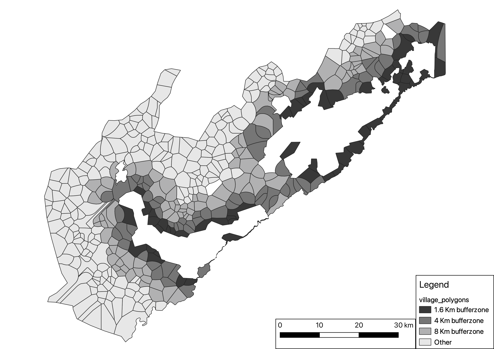

```{r setup, include=FALSE}
knitr::opts_chunk$set(echo = TRUE, fig.align = "center", fig.pos='H')
library(knitr)
library(kableExtra)
library(captioner) #install via devtools::install_github("adletaw/captioner")
library(dplyr)
library(ggplot2)
library(plyr)
library(estimatr)
library(texreg) #latest version needs to be installed via devtools::install_github("leifeld/texreg") (make sure devtools is also installed)
library(plotrix)
library(gridExtra)
library(tidyr)
library(MatchIt)
library(fixest)

# Table and figure captions
table_nums <- captioner(prefix = "Table") 
fig_nums <- captioner(prefix = "Figure")
```

\clearpage

# Introduction
Voluntary carbon offset markets from projects in the tropics are expected to significantly contribute to meeting net-zero climate change objectives in the Global North. In voluntary markets, certified third-party agencies sell carbon credits to buyers who aim to reduce their carbon footprint beyond levels legally required either by national domestic legislation or international commitments[@angelsen2012analysing]. 

Recently, there has been a surge in voluntary carbon credits with the market value rising from \$473 million in 2020 to edging close to \$2 billion at the end of 2022[@foresttrends2022theart]. The value of these offsets is expected to increase at least 100-fold by 2050, as industries and governments aim to meet the 1.5°C Paris target[@taskforce2021]. In response to this surging demand, a new offset industry has emerged in which numerous entities develop carbon offset projects and seek their certification from private organisations through verification processes, after which myriad consultancy companies rate their quality, and sell the offsets to buyers.

Voluntary carbon offsets can be sourced from different sectors and programmes, including forestry, which has coalesced around voluntary REDD+ projects. REDD+ (reducing emissions from deforestation and degradation) operates predominantly in tropical low-income countries with high rates of deforestation and forest degradation. REDD+ projects essentially provide incentives to (individual or communal) ‘owners’ of carbon-rich forests to reduce the baseline rate of deforestation and degradation, thereby increasing the storage of carbon (known as ‘additionality’). Incentives can be financial (cash subsidies) and/or in-kind such as goods or training, with varying degrees of enforced conditionality[@wunder2020redd; @wilebore2019unconditional]. Hundreds of such voluntary REDD+ projects have been initiated globally and have received widespread attention based on their ‘triple-win’ promise: the ability to reduce carbon emissions, improve livelihoods, and conserve biodiversity[@wunder2006efficiency]. However, 60% of REDD+ programmes are not certified to sell offsets in the voluntary carbon credit market, and the remaining is funded by grants[@simonet2021ID-RECCO]. The latter are very different types of programmes as they are typically not subject to the scrutiny of verification agencies or potential buyers.

Within the overall voluntary carbon credit market scene, REDD+ offsets have become the leading category, constituting 40% of the market. More importantly, in 2021 the market showed a 166% annual increase in the volume of traded carbon credits coming specifically from REDD+ projects that avoid unplanned deforestation and a 972% increase in programmes that avoid planned (legal) deforestation[@foresttrends2021market], signalling the dynamism of forestry-based credits. 

Despite this context of ‘REDD+ project-euphoria’, the scientific literature assessing the impacts of voluntary REDD+ offsets remains notably scant[@sills2017building]. Carbon credit verification agencies do include monitoring and evaluation as part of their processes to renew voluntary carbon credits. However, the objectivity, transparency and robustness of these assessments have been called into question, undermining the credibility and viability of the voluntary offset market[@west2020overstated]. This controversy[@greenfield2023revealed] has increased the calls within the scientific and policy communities for more independent and rigorous assessments of REDD+ projects [@sills2014redd; @sills2017building; @duchelle2018people; @simonet2018forests; @integritycouncil2022core].

Two central aspects of voluntary REDD+ projects require independent evaluation:  whether they secure carbon additionality (and avoid leakage or displaced deforestation) [@angelsen2008moving] and deliver benefits to local communities [@herr2019ananalysis, @sunderlin2017redd]. Many evaluations have relied largely on case studies that use data collected *after* REDD+ projects commenced and/or without meaningful information from comparison sites[@angelsen2018transforming]. Rigorous evaluations (that are purposefully designed to explore causal relationships as opposed to correlations) require the use of empirical methods that both compare locations that benefit from REDD+ projects with comparable control sites, as well as assess relevant data from the pre- and post-REDD+ project period. This enables researchers to undertake so called Before-After-Control-Intervention (BACI) assessments [@correa2020evaluating; @simonet2018forests; @duchelle2017balancing; @sills2017building]. Yet, these types of studies are remarkably sparse [@wunder2020redd].

Supplementary Information A and Table A1 summarises published work that uses BACI approaches to assess the environmental effectiveness and livelihood impacts of REDD+ initiatives. The majority of studies focus on non-certified sub-national REDD+ initiatives, or projects that were in the early stages of development (pilot schemes) [@bos2017comparing; @duchelle2017balancing; @sunderlin2017redd; @simonet2019effectiveness; @carrilho2022permanence; @cisneros2022impacts; @correa2020evaluating; @ellis2020mixed]. The overall picture that emerges from this work on mostly non-certified REDD+ initiatives is that they have had a rather muted impact on deforestation. 

Remarkably, just four studies to date, focus exclusively on actually certified REDD+ projects [@west2023action; @west2020overstated; @delacote2022revisiting; @guizarcoutino2022aglobal]. All four focus on assessing deforestation impacts only and do not assess the livelihoods impacts or behavioural mechanisms that could explain any changes in deforestation. They tend to rely on remote sensing data rather than field survey data. Where survey data is included, it tends to be *ex-post* rather than collected ‘before and after’, in recipient non-recipient control (i.e. comparable) groups. A few studies find mildly positive or at least no negative impacts on welfare and livelihood indicators [@duchelle2017balancing; @simonet2019effectiveness; @jagger2017using].

In sum, the available body of evidence still leaves many under-researched issues concerning the environmental and economic impacts of voluntary carbon offset schemes. In this paper we contribute to the need to build the evidence base by reporting on a study that evaluates the impacts of an actual certified voluntary REDD+ project. In particular, we contribute a BACI assessment of the impacts of such a project five years after its commencement and consider the causal pathways through which REDD+ operates. Notably, we also add a cost-to-carbon analysis.

Our evaluation focuses on the REDD+ project surrounding the Gola Rainforest National Park (GRNP) in Sierra Leone, West Africa, established in 2011. Visual assessment of satellite images suggests that forest cover within the uninhabited GRNP has largely remained intact (`r fig_nums('figForestlossGola', display = 'cite')`). However, deforestation has increased in the area outside the park boundaries where regulatory prohibitions do not apply. This buffer zone (4 km width) aims to protect the park from encroachment that may result from growing population pressure and serves as a corridor for species migration between the different park sections. In addition, the buffer zone is the expected area of leakage due to the imposed restrictions of logging within the park.  The REDD+ project received certification in 2015 (although project activities started in 2014) by Verra, one of the largest carbon credit certification agencies. Its primary aim is to protect tropical forest inside the GRNP as well as in this buffer zone[@verra2022]. There are no large communities residing within the park; instead, the programme focusses on communities located within the buffer zone. The Gola REDD+ project was also designed to incentivise these buffer zone communities to shift away from traditional to more sustainable agricultural practices (such as forest-friendly crops like cocoa) through a range of REDD+ activities including agricultural extension to increase yields, marketing support for securing better prices, and access to (co-managed) financial services (see Supplementary Information C for a detailed description of the REDD+ programme and prior activities in the area). As is the case with many REDD+ projects[@wunder2020redd] the incentives for the specific scheme are only weakly conditional on conservation behaviour.

We evaluate the short run impact of REDD+ on deforestation rates, economic wellbeing and conservation attitudes within the park buffer zone for the first five years of the project, spanning 2014-2018. We use satellite imagery to assess causal changes in deforestation rates and multiple rounds of detailed on the ground household-level survey data collected both before and after REDD+ activities began. The latter allows us to estimate the impacts on economic wellbeing and assess potential mechanisms behind any impacts of REDD+ on deforestation rates (See Supplementary Information D for data description). As the interventions were not randomly assigned to communities, our control group consists of comparable communities that lie within the chiefdoms of the park, but outside of the 4 km buffer zone. We conduct a simple cost-to-carbon calculation and compare the estimated cost per averted tonne of carbon to similar programmes globally. 

Our study adds to the empirical work on evaluating REDD+ projects and makes several contributions. First, we undertake an analysis of an operational, fully developed, voluntary REDD+ project that actively sells carbon credits in voluntary markets and has been approved by a leading verification agency. As detailed in Supplementary Information A, most published impact evaluation studies on REDD+ projects focus on non-certified initiatives or pilots. Secondly, we established an agreement with the agencies developing the Gola REDD+ project to instate an independent BACI evaluation before the start of the project and was conducted separately from the verification processes required by Verra. A rare feature of this design amongst similar studies, is that we also make use of detailed baseline household survey collected prior to the commencement of the project (2014) and corresponding endline data collected more than five years after the project began (2019). In addition, with access to a previous round of data (2010), we are able to explore parallel trends prior to the programme between project and control sites. Hence, our data allows for a rigorous impact assessment, evaluating REDD+ impacts on economic wellbeing, deforestation rates, as well as the likely mechanisms that lead to any observed changes in the latter. Our analysis is limited to assessing the impacts of the REDD+ project within the buffer zone and does not include the GRNP itself because there is no credible counterfactual for the GRNP. Also, from a policy and REDD+ design point of view, deforestation pressure and leakage are likely to be larger in the buffer zone. Our analysis strategy is based on a pre-analysis plan which was submitted to an open access repository before data was analysed (OSF id: 8n7h6). This aspect of our analysis contributes to the objective of improving transparency and credibility, which is increasingly called for and supported by researchers working in the environmental policy domain [@wiik2019experimental; @parker2019making; @ferraro2009counterfactual]. It is also essential for building the much-needed evidence base of independent and transparent studies on voluntary REDD+ projects.  

# Results
Deforestation is a severe problem in Sierra Leone, which, in the past two decades, has lost around 25% of its tree cover. This trend is mainly driven by small-scale traditional agriculture[@curtis2018classifying]. Pressure on protected areas (PAs) in the country is high. `r fig_nums('figForestlossBuffer', display = 'cite')` shows forest loss rates within 8 PAs in Sierra Leone (Panel A) and its buffer zones (Panel B) for the 2001-2018 period. Average forest loss within PAs is around 1% per year in the 2013-2018 period, lower than the national average just under 3%, see Supplementary Figure B1 for graphs for each PA separately). There is substantial pressure on PA buffer zones, with average deforestation rates of around 2.5% per year between 2013 to 2018. Very similar trends are observed in neighbouring Guinea and Liberia (see Supplementary Figure B2), all pointing to the need for effective programmes that are able to reduce deforestation in sensitive areas such as PA buffer zones. It is against the backdrop of these worrying trends, that we evaluate the impact of the REDD+ project implemented in the crucial buffer zone of the GRNP.

## REDD+ impact on deforestation
To assess the impact of the REDD+ project, we focus on changes within REDD+ communities (i.e. those in the buffer zone around the GRNP) and compare these to changes in communities adjacent (i.e. 4-20 km) to the buffer zone, thereby keeping many factors constant (including population density, demography, land use and market access — all potential drivers of deforestation – see also Supplementary Table D2 for very similar levels of these drivers for REDD+ and non-REDD+ communities). We use data from the 454 communities surrounding the GRNP, of which 126 lie within the 4 km buffer zone and received REDD+ interventions. We examine forest loss for these REDD+ and remaining 328 non-REDD+ communities over time (covering 2001-2018, with the REDD+ programme starting in 2014). Based on community location and population size, we use Voronoi polygons around each community to assign yearly forest loss rates (see Supplementary Information D for a detailed description of the data generation process). Yearly deforestation rates in both types of villages for the evaluation period 2001-2018 are shown in `r fig_nums('figForestlossResults', display = 'cite')`. Visual inspection highlights that prior to the start of the REDD+ programme deforestation rates in both groups trended very similarly. After the start of the programme, the percentage forest loss is significantly and substantially higher in non-REDD+ communities compared to REDD+ communities.  

To formally test the impact of REDD+ in the GRNP buffer zone, we use a difference-in-difference regression analysis to assess the change in trends over time (`r table_nums('tabResults', display = 'cite')`). We find that the REDD+ programme reduced (but not reversed) deforestation in the REDD+ communities by about 1 percentage point (or 30%) compared to non-REDD+ communities. Hence, while the programme reduced the amount of deforestation by about 929 ha per year in the buffer zone, it did not remove pressure on forests completely. Our results are robust to the use of different datasets, using matching combined with difference-in-difference estimates, and alternative definitions of the treatment and control samples (described in detail in the Robustness analysis section of this paper and in Supplementary Information F).

To benchmark these changes in deforestation, we perform a cost-to-carbon analysis. The REDD+ project led to around 340,000 tCO2 in avoided emissions per year with an estimated cost per averted tCO2 of \$1.12. We further place this calculation into perspective in the Discussion section (full details of the calculations can be found in Supplementary Information G).

## REDD+ impact on economic wellbeing and conservation attitudes
To measure how economic wellbeing and conservation attitudes in the REDD+ buffer zone communities were impacted by the project, we use detailed primary data from household surveys of N=841 households collected before (2014) and five years after the programme started (2019). We find an overall increase of 0.222 standard deviation (SD) in the economic wellbeing index over the five years of the programme, which comprises a substantial and significant improvement, see Column 2 of `r table_nums('tabResults', display = 'cite')`. However, this increase cannot be attributed to REDD+ as there is no difference between REDD+ and non-REDD+ communities (the coefficient for the difference is small at 0.022 SD). 

We also find no evidence that conservation attitudes changed due to the programme (see `r table_nums('tabResults', display = 'cite')`, Column 3). Between the survey waves, the index for pro-conservation attitudes lowered substantially in both types of villages, by about 0.226 SD. Though the attitudinal index is an outcome variable on its own right, it can also be viewed as a mechanism driving the impact of deforestation. We find no evidence of such a causal mechanism at work, so we explore other mechanisms in the next section.

For results on each survey indicator, as specified in our pre-analysis plan, refer to Supplementary Information E, presenting standardised outcomes in Tables E2 and E3 and unstandardised outcomes in Tables E4 and E5. We also include a series of secondary outcomes (consisting of alternative wealth measures) in Tables E6 and E7. Across all of these tables the interaction term is never large or significant. Our results are also robust to using alternative quasi-experimental methods (described in detail in the Robustness analysis section of this paper and in Supplementary Information F). 

It is important to emphasise that whilst the Gola REDD+ project has not improved local economic wellbeing or conservation attitudes, we can equally conclude that the project has not resulted in any economic harm or undermining of pro-conservation sentiments. Such ‘no harm’ is a vital feature for the viability of REDD+ projects that cannot be overestimated [@angelsen2018transforming]. More importantly, our finding has enhanced significance in the associated literature, as it stems from a more robust methodological approach. 

## Potential mechanisms
We next explore other mechanisms that could explain the observed reduction in deforestation rates. Earlier studies have pointed to changes in the local labour allocation as a key factor affecting traditional small-scale agriculture in Sierra Leone [@wilebore2019unconditional; @maffs2011agricultural; @mokuwa2011peasant]. Using the same household survey data collected before and after the intervention from both treated and control communities, we explore several such possible mechanisms in `r table_nums('tab_mechanisms', display = 'cite')`.

We first assess an index of labour availability for the three main types of farms (upland, swampland and plantation). In REDD+ communities there is a sharp reduction (0.545 SD) in access to farm labour (Column 1). In real terms, this reduction translates to a change in labour access of 0.534 on a scale from 0 to 3, where 3 indicates high labour access. This suggests that high labour demand for the activities supported through the REDD+ intervention reduces the amount of labour available for land clearing activities. 

Secondly, incomes from farm wages are substantially higher (0.199 SD) in REDD+ communities since the start of the interventions (Column 2). This amounts to an increase of income from farm wages of 43.5%. Non-REDD+ communities at baseline had a yearly farm wage income of 29,000 Leones (or \$6.7, in 2014 1$ was approximately 4320 Leones). The REDD+ project may have increased the opportunity cost of labour by providing alternative income possibilities. When farmers choose to pursue these alternative income possibilities, it leaves fewer labourers available for the local labour market (and thus reducing labour access). This in turn leaves fewer labourers for conventional, labour-intensive traditional agriculture, which is associated with deforestation. This lower labour availability and higher opportunity cost increase the local labour price, which increases income from working on other people’s farms. Because a decrease in labour access could also be driven by out-migration in the REDD+ communities, we test whether community population size changed due to the REDD+ programme and find no evidence for this (see Supplementary Table E8). Also, note that this increase in farm wages does not result in overall increases in economic wellbeing.

Because the REDD+ programme aimed to provide more ecologically sustainable (or forest-friendly) alternative income sources, we examine trends in such sources. We explore income from the sale of Non-Timber Forest Products (NTFP). NTFPs are collected in forested areas (including within the GRNP). The activity is encouraged by the GRC, as it is non-invasive and creates incentives for protecting the national park. We find a substantial increase in NTFP incomes of 0.343 SD in REDD+ communities in the later period (Column 3). This translates to a 56.7% increase in NTFP income attributable to the REDD+ programme. In contrast, non-REDD+ communities exhibited no statistically significant change in their NTFP income and had a baseline value of approximately 108.400 Leones ($25). 

Finally, we explore whether farmers switched to other crops, such as cocoa. In this context, cocoa is deemed more forest-friendly by the project developers, as cocoa is produced within forests. We find an increase in cocoa harvest size (0.196 SD, Column 4) in REDD+ communities in the later period, though this is measured with substantial noise and the change is not statistically significant.

# Discussion
The market for voluntary carbon credits stemming from REDD+ projects is booming. Evidence on the deforestation and economic wellbeing impacts of these projects originating from independent, robust, and causal studies is however surprisingly limited. We contribute to this significant knowledge gap by examining the impacts of an operational voluntary REDD+ project implemented in the buffer zone surrounding the GRNP in Sierra Leone. We find that the REDD+ programme decreased yearly deforestation rates by 30%. This shows that a relatively light-touch programme in the form of unconditional in-kind interventions can have beneficial effects on the natural environment. This impact is however modest, and the programme does not remove deforestation completely, rather it helps slow down the deforestation trend. This raises questions about the sustainability of the programme, as it leaves no guarantees that the pressure on forests is removed, and communities have shifted to a new forest-friendly equilibrium. The results are in line with other recent studies that use different methods and focus on different types of carbon offset programmes [@bos2017comparing; @west2020overstated; @correa2020evaluating; @simonet2019effectiveness; @ellis2019reduced; @guizarcoutino2022aglobal].   

Despite the programme slowing rather than reversing deforestation trends, the avoided deforestation amounts to about 929 ha and around 340,000 tCO2 in avoided emissions per year. Available cost-benefit analyses of similar land use projects suggest that this is at the higher end compared to what has been achieved elsewhere (e.g. Jayachandran et al. (2017) calculate a cost of \$0.46 per avoided tCO2 for a reforestation and afforestation project and Simonet et al. (2019) report \$0.84 per tCO2 for a REDD pilot project) [@jayachandran2017cash; @simonet2019effectiveness]. Cost comparisons across different REDD+ type projects can however be misleading as calculations, methods and assumptions vary considerably. Yet, we can nevertheless more safely conclude that this specific REDD+ project does appear to avert carbon at a cost which is considerably lower than the average sales price per offset within the evaluation period, at approximately \$3 per credit [@foresttrends2021market]. It is worth noting that land use projects are generally cost-effective compared to other carbon reduction technologies, such as carbon capture and storage (CCS) which can cost between \$40 to \$400 per tCO2, or other expensive yet scalable technologies like electric vehicle batteries (\$350-\$640), solar panels (\$140-\$2100), and offshore wind turbines (\$2-\$260) [@gillingham2018thecost]. While other low-cost interventions, such as behavioural nudges like OPOWER's home energy reports[@allcott2010behavior], exist to tackle carbon reductions, they are expected to produce relatively small emission reductions compared to land use programmes.

We also assess if this type of REDD+ project can improve economic wellbeing. Using rare panel survey data, we find no clear evidence of changes to economic wellbeing, although we do observe increases in particular income streams (i.e. NTFP collection). We also examine the mechanisms through which deforestation was reduced in the buffer zone. We find no evidence of improved conservation attitudes but hypothesise that the REDD+ project affected the opportunity cost of labour, which increased the local labour price through creating alternative income possibilities. Some of these possibilities are sales of Non-Timber Forest Products and (forest-friendly) cocoa farming, though we find no evidence of other changes in income or production. As such, our findings contribute to the discussion about the potential impact of REDD+ projects on the economic welfare of local communities.

Taken together, our results highlight that interventions such as agricultural training and savings and loans programmes can slow the rate of deforestation whilst not causing economic harm to local communities. The interventions are not effective in generating positive changes to participants’ economic wellbeing. To achieve higher levels of environmental protection and improve the contribution of REDD+ to human wellbeing, more intensive interventions and considerable investment may be necessary. Our research also provides insights into the behavioural mechanisms that underlie the observed ecological impacts, suggesting that promoting targeted alternative sustainable livelihoods, such as non-timber forest products and cocoa, and addressing local labour market impacts are crucial to the success of REDD+ initiatives.

Rigorous independent evaluation methods of the impacts of voluntary REDD+ projects are increasingly called for by the scientific community. Stated carbon emission reductions by carbon verification agencies have recently been scrutinised [@greenfield2023revealed; @west2020overstated]. With this study, we attempt to bridge this gap by using a rigorous identification strategy set-up independently from the verification process. A clear-cut comparison between our findings and those from the verification is, unfortunately, not straightforward. Our evaluation focusses on the buffer zone (the area for which we have a credible counterfactual). Instead, the certification agency Verra bases their assessment on avoided deforestation within the National Park as well as the buffer zone. Second, Verra focuses on a different time period for the verification (2012-2014), whereas we focus on the five-year period after GRC commenced REDD+ activities (2014-2018). With these caveats in mind, we can attempt an approximate per hectare comparison of our avoided deforestation results with those of Verra. Verra’s estimate of avoided deforestation is 940/ha/year (averaged over the entire Gola REDD+ project area). This is close to our own estimation of 929 ha/year (averaged over the buffer zone area alone). See Supplementary Section H for details. 

Previous impediments to undertaking rigorous evaluation studies of REDD+ projects related to the cost of data collection, uncertainty about which evaluation methods to use, and hesitancy from funders and project developers due of the fear that any disappointing short-term evaluations could jeopardise future financing[@simonet2018forests]. Our experience from completing this study suggests that these concerns are increasingly waning. Improvements in technology and capacity building have reduced the costs of such evaluations while there have been substantial advances in our understanding of the methods used. Further, we are now beyond the piloting phase of many REDD+ projects and thus have data over longer periods. We have also witnessed a shift in the mentality of project developers who are more willing to embrace best practice evaluation methods and receive support setting up independent rigorous assessment methodologies (as - to their credit - did the agencies involved in the REDD+ project). Given the demand pressures to significantly increase the supply of these voluntary offsets, it is even more timely to call for more studies such as this one to add to the evidence base on voluntary REDD+ projects. 

# Methods
The analyses in this paper rely on three main sources of data: satellite data using a publicly available dataset by Hansen et al. (2013)[@hansen2013high], border definitions (polygons) of all protected areas in Sierra Leone and survey data collected over three rounds in communities surrounding the GRNP (implemented in 2010, 2014 and 2019). Informed consent was obtained from all respondents interviewed. Ethical oversight was provided by Wageningen University and the University of Cambridge through their respective IRB's. For our data analysis we use R version 4.2.2 (2022-10-31), RStudio version 2022.07.2, and self-written code.

## Deforestation data
The dataset by Hansen et al. (2013) provides worldwide yearly data on forest loss [@hansen2013high]. We use data from the 2001-2018 period. The dataset has a high-resolution with a pixel size of 30x30m (see Supplementary Information D for more information). This allows us to use detailed information and recognise small-scale deforestation events (as is likely with traditional agricultural practices). Forest is defined as an area with >50% vegetation taller than five meters. Forest loss is defined as a change from a forested to non-forested. We disaggregate forest loss to the year and village (or community) level. To assign forest loss to specific villages we use data from Wilebore and Coomes (2016)[@wilebore2016combining]. First, simple Voronoi polygons are drawn for all villages in the seven Chiefdoms in which the GRNP lies (454 villages in total). Then, some of these polygons (228 in total) are adjusted in size based on the estimated village population size obtained through a village survey in 2010. Unsurveyed villages are not weighted (our results are similar when we run the analysis for weighted polygons only - see Supplementary Table F5). The resulting predicted village polygons were verified using GPS boundary data collected for a sample of 98 of the villages (see Supplementary Figure D1 for the polygon map and Supplementary Information D for more information on the estimation method). The data on locations and population sizes are based on a survey of 228 villages in 2010. Finally, we count the number of pixels indicating forest loss in a village polygon in a given year and calculate the percentage forest lost by dividing the area deforested by the size of the polygon. By using the percentage, we can compare villages with different-sized land holdings.

## Protected Areas definition
We place the observed deforestation rates in the GRNP into context by examining other Protected Areas (PAs) in Sierra Leone. This analysis is based on a map provided by the Sierra Leonean Ministry of Agriculture, which we use to infer the exact borders of the PAs. We examine all existing national parks, forest reserves and game sanctuaries with a legal protection status. The Hansen et al. (2013) deforestation data is used to examine forest loss over the 2001-2018 period for each PA separately. We also examine forest loss in buffer zones, which provide important corridors for endangered species and prevent encroachment. We use a 4 km distance from the border to define this buffer zone, to be consistent with the GRNP's buffer zone. We only consider buffer areas that fall within the national borders of Sierra Leone. Deforestation results for these national parks are shown in Supplementary Information B. We use data from the World Database on Protected Areas to extend our analysis to PAs in Guinea and Liberia.

## Survey data
We use primary survey data collected in Sierra Leone during three survey waves. During March/April 2010, Wageningen and Cambridge University researchers collaborated with GRC to implement a baseline survey in villages in the seven chiefdoms surrounding the GRNP. GRC selected 200 villages that were closest to the National Park and most likely to have community forests with high biodiversity value. From this list, 11 did not exist (anymore) and the survey was subsequently implemented in 189 communities. This survey is also the source of village locations and sizes, which are used in the Voronoi polygon definition by Wilebore and Coomes (2016)[@wilebore2016combining]. In each village, 15 households were randomly sampled and interviewed regarding demographics, economic outcomes, hunting and gathering behaviour, and attitudes towards conservation. We implemented a second survey in April 2014, just prior to the start of REDD+ activities. From the villages included in the 2010 survey wave, we randomly selected 30 REDD+ villages, i.e. those eligible for REDD+ benefits. These communities all lie within a 4 km buffer zone around the National Park. We also selected 30 non-REDD+ villages which were randomly selected from villages 4-25 km from the National Park boundary. The sampling was stratified by regional quadrants to ensure representation of villages between the GRNP boundary and the border with Liberia. One of the REDD+ villages was removed from the sample as it no longer existed, bringing our full sample down to 59 (see Supplementary Figure D3 for a detailed map). The same households as in 2010 were interviewed. During this survey wave, in total 841 households were surveyed across the 59 villages, with an average of 14 households per village (some villages had fewer than 15 households). For the follow-up survey during April 2019, we revisited each household included in the 2014 survey. If the head of household was not available, we selected a representative of the household. We recontacted 81% of the of the 2014 sample in 2019. The 2014 and 2019 survey waves are used for the main analysis, whereas the 2010 round is used to explore parallel trends (see Parallel trends section). An attrition analysis for all primary outcomes shows no bias in attrition between REDD+ and non-REDD+ villages (see Supplementary Table D6).

## Survey outcomes 
We assess two main survey outcomes: an index of outcomes related to economic wellbeing and an index related to conservation attitudes (a description of family outcomes and the variables they consist of can be found in Supplementary Table D1 and descriptive statistics in Tables D3 and D4). By grouping our variables into families, we reduce the number of statistical tests necessary. We use the approach by Kling et al. to combine variables with different units into families[@kling2007experimental]. This works by first normalising all variables, and then taking the raw mean of these z-scores. If an observation is missing for a certain variable, this is imputed at the own-group mean (i.e. by survey round and treatment status).

The economic wellbeing family consists of data on income, expenditures, resilience, productive loans and assets. Income is the sum of a very broad range of income categories which includes almost all sources of income, thereby increasing our precision. We ask this question over the previous year. We also look at two forms of expenditures as a more robust estimate of income. We ask about expenditures in the previous month on a set of common consumption items. We also ask about yearly expenditures on larger, less regular items. Resilience is measured as a dummy indicating whether individuals were able to cope with an emergency in the previous year. Durable loans are the sum of loans in the previous year for productive/durable activities. Assets is the sum of a common set of assets owned, such as tables, beds, and housing materials. Outcomes that are expressed in monetary terms (income, expenditures, and productive loans) are transformed using the inverse hyperbolic sine function, reducing the variance of the outcome.

The conservation attitude family consists of stated attitudes, knowledge of conservation rules, use of sustainable farming practices and perception of human-wildlife conflict. Stated attitudes are responses on a five-point Likert scale to four questions related to the GRNP and conservation in general. Knowledge of conservation rules is assessed by asking five questions about what is allowed and not allowed in the national park (on mining, gathering, fishing, logging, and hunting). Sustainable farming is the number of sustainable farming practices used, for example on land use. Finally, we ask how big of a problem human-wildlife conflict is (on a 0-3 scale). Increased human-wildlife conflict is often associated with the creation of the national park, which might have increased animal populations.

We also explore other potential mechanisms, mainly related to changes in the local labour market. Labour is one of the main seasonal constraints for agricultural production in Sierra Leone, with over 65% of households reporting labour shortages in the agricultural season in a nation-wide survey [@maffs2011agricultural]. To assess labour shortages we ask respondents how much of a problem it is to get labour (scale 0-3) for the three main types of farms and calculate the average value. We also assess income from farm wages in the previous year and look at yearly income from NTFPs (Non-Timber Forest Products). NTFPs are an important alternative form of income associated with the creation of the national park, as these are explicitly allowed to be collected and will be more plentiful if the park is well-preserved. Finally, we include estimates of cocoa harvests in the previous year.

## Empirical strategy
To estimate the effect of REDD+, we use a standard difference-in-difference (or BACI) model:

$$ \mathbf{Y}_{ijt}=\beta_0 + \beta_1REDD_j + \beta_2post_t  +\beta_3post_t*REDD_j + \varepsilon_{ijt} $$

Where $\mathbf{Y}_{ijt}$ refers to our set of outcomes (either deforestation rates at the community level or a household-level family indicator), $REDD_j$ is a dummy for villages within the buffer zone (i.e. REDD+ eligible communities), $post_t$ is a dummy referring to the second survey wave (2019).  $\beta_3$ is our coefficient of interest. $i$ indexes the household level (only for household-level outcomes), $j$ indexes the village level and $t$ the survey wave. For our household-level outcomes, we cluster standard errors at the village level ($\varepsilon_{ijt}$). Only households for whom we have panel data (e.g. they were interviewed in both rounds) are included. This estimator provides us with an unbiased estimate of the treatment effect if we can assume that without the project, the communities would have trended similarly (parallel trends assumption). We explore this assumption in the next section.

## Parallel trends
Our main identifying assumption is that outcomes in REDD+ communities would have trended similarly as non-REDD+ communities, had the REDD+ project not been implemented. Even though this parallel trends assumption is fundamentally untestable, we do several comparisons of REDD+ and non-REDD+ communities prior to the REDD+ intervention to show that this assumption is likely to hold.

Generally, REDD+ and non-REDD+ communities exhibit remarkably few significant differences in village-level as well as household-level indicators, of which many (such as the amount of human settlement, geographical factors, distance to markets, agricultural production) are important drivers of deforestation (see Supplementary Table D2). At the village-level, only village size is significantly smaller in REDD+ communities compared to non-REDD+ communities. At the household-level, slightly fewer household heads obtained some form of secondary education in REDD+ communities. Through a matching procedure described in the Robustness analysis section, we address these differences and find similar results.

As for our deforestation outcome, we have multiple rounds of pre-REDD+ data available, i.e., the years 2001-2013 in Figure 3. Trends (and levels) were very similar prior REDD+ activities, which suggests that this would have continued without REDD+. There is a break in levels coinciding with the inclusion of satellite data from Landsat 8, resulting in more accurate measures of deforestation. However, this change on levels affects both types of villages (robustness of this data is further addressed in the next section). The presence of parallel trends prior to the start of REDD+ is also visible when we run an event-study model in which we estimate year-specific effects of REDD+, shown in Supplementary Figure D2. All year-specific treatment effects before 2014 are insignificant and close to zero, except for the year 2002 where differences are still very small.

For our survey outcomes, we make use of the unique opportunity of having access to two rounds of pre-REDD+ data (the 2010 and 2014 rounds of data). We first inspect if there are any meaningful level differences between REDD+ and non-REDD+ villages (see Supplementary Table D3 and D4). Differences are small and, in most cases, insignificant. In 2010, yearly irregular expenditures and income from NTFPs were slightly lower in REDD+ villages. This difference dissipates by 2014, hence we doubt that access to cash (important to mobilise labour for deforestation) affects our results. Sustainable farming practices were higher in 2010 but the difference also fades by 2014. In 2014 awareness of conservation norms is somewhat higher in REDD+ communities. If this means that there is not as much scope for this awareness to increase because of REDD+, this would bias our results downward. In 2014 human wildlife conflict is also higher in REDD+ communities. This could be caused by closer proximity to the National Park, which contains much of this wildlife. One way farmers could deal with this, is through removing trees surrounding their farms, thereby reducing wildlife access. If this is the case, the reduction of deforestation we find is a lower bound of the real effect.

Note that these level differences are only problematic if they affect the trend of our outcomes, as level differences drop out in the difference-in-difference approach. To assess systematic differences across both data waves, we re-run our difference-in-difference model for 2010-2014 data on the main outcomes and mechanisms for which data is available (Supplementary Table D5). In no case is the 2014*REDD+ coefficient significant: we find no significantly different trends between the two groups. 

As a robustness check, we combine our difference-in-difference model with matching techniques and find similar results on our deforestation, economic wellbeing and attitudes outcomes (see Supplementary Table F3 and F7 and the Robustness analysis section below).

A potential concern is that our result is driven by leakage from the REDD+ area to the control area. This seems unlikely as REDD+ communities have few incentives to move their activities elsewhere. Cutting  trees is legal in the buffer zone of the park (i.e. the REDD+ communities). Second, the REDD+ project is not conditional on deforestation outcomes in the buffer zone. Third, cutting trees is labour intensive and typically done on foot. Thus, it is not very likely that REDD+ communities moved to non-REDD+ areas for farming or other activities that require cutting trees. An additional source of leakage could be that treated communities buy more wood on the market sourced from the control areas. This is unlikely because wood demand in the area mostly stems from urban construction. Any market leakage is therefore expected to be negligible.  

## Robustness analysis
We run multiple robustness checks to address potential concerns about the quality of the satellite data and the comparability of REDD+ and non-REDD+ villages (see Supplementary Information F for all robustness analyses). First, we use an alternative deforestation dataset, the Tropical Moist Forest (TMF) data by Vancutsem et al. (2021)[@vancutsem2021long]. We find a similar negative effect of REDD+ on forest loss (the effect size is -0.759 percentage points which amounts to around 27% less forest loss yearly, see Supplementary Figure F1 and Table F1). 

To improve comparability between REDD+ and non-REDD+ villages, we use matching (both propensity score matching and coarsened exact matching) in combination with difference-and-difference for both deforestation datasets. We find consistently negative effects of REDD+ on deforestation with coefficients varying from -0.618 vs. -1.297 percentage points forest loss per year (Supplementary Table F3).  

A potential concern is that the higher precision Landsat 8 imagery from 2013 is driving our deforestation result. Forest loss measurements could for instance be less precise, as proximity to the national park increases. We run multiple tests to address this concern (Supplementary Table F4). First, we run the same model but restrict our sample to all communities within 8 km of the park (thereby defining only communities in the 4-8 km zone as the control group), this hardly changes our estimates. We run a falsification check by removing the REDD+ communities from our sample and defining the 4-8 km zone as the treatment group, comparing it to the remaining non-REDD+ communities. The deforestation result disappears, indicating that proximity to the national park is not likely to affect forest loss measurement. We also run our model with Landsat 8 data only, for the years 2013-2018, excluding the lower-precision years, which hardly changes our estimates (Supplementary Table F5). Last, we run our model excluding all villages that lie within 1 mile of the GRNP. GRC had been active in this area prior to the start of the REDD+ programme (details about their activities can be found in Supplementary Information C). We find that the effect is significant albeit somewhat smaller (-0.741 vs. -1.032 percentage points, see Supplementary Table F4). This could suggest that prior conservation activities had a long-term effect on deforestation in this area. Alternatively, it could mean that REDD+ is more effective in villages near the national park. 

In sum, these robustness checks suggest that the REDD+ programme reduced deforestation rates by around 1 percentage points or 30% yearly.

# Data availability
The data used in this paper are available in a GitHub repository (repo: MandyMalan/gola-redd-impact). Raw survey data and household-level covariates dataset used for matching in our Robustness section are not published because to ensure anonimity of our respondents. Data can be made available upon request. Public data used in this paper are from Hansen et al. (2013) (Version 1.6 available at: https://earthenginepartners.appspot.com/science-2013-global-forest/download_v1.6.html), Vancutsem et al. (2021) (available at https://forobs.jrc.ec.europa.eu/TMF/data.php#downloads), and Worldwide Database on Protected Area (available at https://www.protectedplanet.net/en/thematic-areas/wdpa?tab=WDPA).

# Code availability
All code needed to reproduce this paper are published in a GitHub repository (repo: MandyMalan/gola-redd-impact). Code used for cleaning data is not published and can be made available upon request.

# Acknowledgements
We are indebted to the Royal Society for the Protection of Birds (RSPB) and to the Gola Rainforest Conservation LG (not for profit company), BirdLife International, Esther Mokuwa, Paul Richards, and Martha Ross for their collaboration in this project. We thank GCRF QR at the University of Cambridge and NWO for financial support (grant VI.Vidi.191.154 received by M.V.). We acknowledge the loyalty and hard work of the team of field enumerators and the patience and cooperation of interviewees.

# Author contributions statement
All authors conceptualized the project; M.M and P.H curated the data; M.M., P.H, T.S undertook formal analyses; M.V and A.K. acquired funding; M.M., P.H., M.V, T.S and E.G. performed the investigations; all authors designed the methodology; M.V. administrated the project; M.M., A.K., P.H. and M.V supervised the work; all authors validated the findings; M.M. and, P.H visualized the data; M.M. P.H. and M.V. wrote the first draft, and all authors contributed to the review and editing of the paper.

# Competing interests statement
The authors declare no competing interests. The authors did not receive financial or non-financial benefits from the donors, or any other partners related to any of the interventions presented here. The Cambridge Centre for Carbon Credits (4C) has no commercial interest in carbon credits. T.S. worked as a conservation scientist for the Royal Society for the Protection of Birds (RSPB) until 2020. The RSPB maintains close ties with the Gola Rainforest REDD+ program. T.S. had no direct involvement in the design and implementation of the REDD+ program. We pre-registered this study with the EGAP-OSF registry after data collection, but before data processing and analysis (OSF id: 8n7h6).

# References {-}
<div id="refs"></div>

<!-- Analysis -->
```{r data, include=FALSE, warning=F}
### Functions ----
# To add figure legend in grid.arrange
g_legend<-function(a.gplot){
  tmp <- ggplot_gtable(ggplot_build(a.gplot))
  leg <- which(sapply(tmp$grobs, function(x) x$name) == "guide-box")
  legend <- tmp$grobs[[leg]]
  return(legend)
}

# To split strings
str_filter <- function(x, sep = ",", side = "left", greedy = TRUE) {
  gsub(switch(side,
              left  = c(ifelse(greedy, "", "?"), ")", sep, "\\s*"),
              right = c(ifelse(greedy, "?", ""), ")\\s*", sep)) %>%
         c("(.*", ., "(.*)") %>%
         paste0(collapse = ""),
       switch(side, left = "\\2", right = "\\1"), x)
}

# To standardize outcome to control group (fec=0) mean at baseline (year==2014)
stdz <- function(x, dat){
  df = filter(dat, fec == 0, year == 2014)
  var = subset(df, select = x)
  mu_C = mean(unlist(var), na.rm=T)
  sd_C = sd(unlist(var), na.rm=T)
  z_score = (dat[,x] - mu_C)/sd_C
}

# Add significance stars
add.stars = function(p, levels = c('0.1', '0.05', '0.01')){
  star = ifelse(p<levels[1] & p>=levels[2], "*", "")
  star = ifelse(p<levels[2] & p>=levels[3], "**", star)
  star = ifelse(p<levels[3], '***', star)
  return(star)
}

### Loading data ----
# Main analysis
forestloss_PA = read.csv('1_data/forestloss_PA.csv') # Sierra Leone forest loss protected areas 
forestloss_SL = read.csv('1_data/sl_forestloss_trend.csv') # Sierra Leone forest loss trend
dfSat = read.csv('1_data/satellite_outcomes.csv') # Main satellite forest loss outcome
dfOutcomes = read.csv('1_data/survey_outcomes_2014_2019.csv') # Main survey outcomes

# Supplementary information
tableLit = read.csv('2_tables/literature_table.csv', fileEncoding="latin1") # A: Literature table
forestloss_PA_SL = read.csv('1_data/forestloss_PA_WDPA_SL.csv') # B: Protected areas in Sierra Leone
forestloss_PA_LIB = read.csv('1_data/forestloss_PA_WDPA_LIB.csv') # B: Protected areas  in Liberia
forestloss_PA_GIN = read.csv('1_data/forestloss_PA_WDPA_GIN.csv') # B: Protected areas  in Guinea
dfIntervention = read.csv('2_tables/interventionFECs.csv') # C: Intervention information
dfIndicators = read.csv('2_tables/outcomeDescription.csv') # D: Description of primary outcomes and family outcomes
dfSumCov = read.csv('1_data/survey_matching_sumvars.csv') # D: For summary statistics of covariates
dfOutcomes2010_2014 = read.csv('1_data/survey_outcomes_2010_2014.csv') # D: Parallel trends 2010-2014
dfVill = read.csv('1_data/village_survey_2014_2019.csv') # E: Migration proxy village size
dfPred = read.csv("1_data/satellite_matching_covariates.csv") # F: Robustness Satellite matching covariates
#dfMatchSE = read.csv('1_data/06_analysis/survey_matching_covariates.csv') # F: Robustness: Survey matching covariates - NOT PUBLIC
dfCostcarbon = read.csv('2_tables/costcarbontable.csv') # G: Cost to carbon analysis
```

\newpage

# Figures {-}
```{r fignotes, echo=F, warning= F}
figForestlossGola <- paste(
  "\\textbf{Yearly forest loss in the Gola Rainforest National Park area in Sierra Leone.}",
  "This figure shows for each pixel whether any deforestation took place from 2001 until 2018. The dashed line shows the 4km buffer zone in which the REDD+ programme took place.",
  "Source: Hansen 2013/UMD/Google/USGS/NASA."
     )

figForestlossBuffer <- paste(
  "\\textbf{Total forest loss in Gola Rainforest National Park, other Protected Areas in Sierra Leone, and Sierra Leone as a whole.}",
  "The left panel shows total forest loss from 2001 to 2018 in 8 Protected Areas (PA) of Sierra Leone and the average for Sierra Leone. The right panel shows total forest loss from 2001 to 2018 in the 4km buffer zones of these PAs The PAs shown are Gola Rainforest National Park (GRNP), Outamba, Loma Mountains, Western Area Peninsula, Kangari Hills, Tingi Hills, Kambui Hills, and Tiwai Island. See Supplementary Table B1 for separate graphs for each PA. The break in the lines in 2013 denotes the launch of a new satellite (Landsat 8) resulting in more precise measures of forest loss. Source: Hansen 2013/UMD/Google/USGS/NASA."
  )

figForestlossResults <- paste(
  "\\textbf{Total forest loss in REDD+ and non-REDD+ villages.}",
  "This graph shows total forest loss from 2001 to 2018 in REDD+ versus non-REDD+ villages. The village polygons are estimated using population weighted Voronoi estimations. Data are represented as mean village-level values and shaded areas denote 95 percent confidence intervals. The vertical black line indicates the start of REDD+. The break in the lines in 2013 denotes the launch of a new satellite (Landsat 8) resulting in more precise measures of forest loss. Source: Hansen 2013/UMD/Google/USGS/NASA."
  )

figForestlossPa <- paste(
  "\\textbf{Yearly forest loss in the Protected Areas in Sierra Leone.}",
  "This graph shows total forest loss from 2001 to 2018 in Protected Areas of Sierra Leone and their 4 km buffer zones. The break in the lines in 2013 denotes the launch of a new satellite (Landsat 8) resulting in more precise measures of forest loss. Protected area definitions come from the Sierra Leonean government. Source: Hansen 2013/UMD/Google/USGS/NASA."
  )

figForestlossCountry <- paste(
  "\\textbf{Yearly forest loss in the Protected Areas in Sierra Leone, Liberia, and Guinea.}",
  "This graph shows forest loss from 2001 to 2018 in Protected Areas of Sierra Leone, Liberia, and Guinea and their 4 km buffer zones. The break in the lines in 2013 denotes the launch of a new satellite (Landsat 8) resulting in more precise measures of forest loss. Protected area definitions come from the Worldwide Database on Protected Areas. We exclude all polygons below a certain size (10.000 pixels) for readability of the graph and because we are unsure of the reliability of these data. Source of data: Hansen 2013/UMD/Google/USGS/NASA/WDPA."
)

figEventStudy <- paste(
  "\\textbf{Pre-treatment trends and treatment effect of REDD+ per year on forest loss}",
  "This graph shows year-specific treatment effect of REDD+ from 2001 to 2018 on forest loss and parallel pre-treatment trends. Sample includes all 454 REDD+ and non-REDD+ villages. The yearly treatment effects are estimated in an event study set-up using a fixed-effects OLS estimation. Data are represented as mean village-level treatment effects and error bars show 95 percent confidence intervals. The dashed line shows the start of REDD+. Source of data: Hansen 2013/UMD/Google/USGS/NASA."
  )

figForestlossGFC_TMF <-paste(
  "\\textbf{Total forest loss in REDD+ and non-REDD+ villages for GFC and TMF data}",
  "This graph shows total forest loss from 2001 to 2018 in REDD+ versus non-REDD+ villages for the Global Forest Change (GFC) and Tropical Moist Forest (TMF) data. The village polygons are estimated using population weighted Voronoi estimations. Data are represented as mean village-level values and shaded areas in the graph denote 95 percent confidence intervals. The vertical black line indicates the start of REDD+. The break in the lines in 2013 denotes the launch of a new satellite (Landsat 8) resulting in more precise measures of forest loss. Source of data: Hansen 2013/Vancutsem 2021/UMD/Google/USGS/NASA."
  )

figPolygons <- paste(
  "\\textbf{Village polygons for satellite analysis.}",
  "This figure shows the village polygons used for the deforestation analysis. Polygons are estimated using the Voronoi method with weights based on village-estimates of the size obtained from Wilebore and Coomes (2016). If this estimate was not available (not all villages were surveyed), the polygon was not weighted. REDD+ villages are defined as villages that were eligible for the REDD+ programme. Non-REDD+ villages are villages that were not eligible for the REDD+ programme and lie outside the forest edge. There are a couple of polygons excluded because they are part of another protected area (Tiwai island) or leased land by companies (blank polygons in the map)."
)

figSample <- paste(
  "\\textbf{Survey sample.}",
  "This figure shows the sample for the survey data. 30 REDD+ villages, ie those eligible for REDD+ benefits were randomly selected. These communities all lie within a 4 km band around the National Park. We also selected 30 non-REDD+ villages which were randomly selected from villages 4-25 km from the National Park boundary. The sampling was stratified by regional quadrants to ensure representation of villages between the GRNP boundary and the border with Liberia. One of the REDD+ villages was removed from the sample as it no longer existed bringing our full sample down to 59."
)

figPolygonsRobust <-paste(
  "\\textbf{1.6 km, 4km and 8km buffer zone for robustness analysis.}",
  "This figure shows the village polygons used for robustness checks for the results on forest loss. Polygons are obtained from Wilebore and Coomes (2016). The figure shows the eligible REDD+ villages in the 4km buffer zone. The 1.6 km buffer zone shows villages that are 1 mile away from the forest - note that this is determined by the distance to the actual location of the village and not the distance to the village lands (polygon). The 8 km buffer zone band shows the 8km buffer zone that we use for the roustness tests below. There are a couple of polygons excluded because they are part of another protected area (Tiwai island) or leased land by companies (blank polygons)."
)

```

```{r figForestlossGola, echo=FALSE, fig.cap=figForestlossGola, fig.align="center", out.width = '70%'}
# Figure 1: Yearly forest loss in the Gola Rainforest National Park area in Sierra Leone.

```

```{r figForestlossBuffer, echo=FALSE,warning = FALSE, message = FALSE, fig.pos = 'H', fig.align='center', fig.cap=figForestlossBuffer, fig.height = 4, fig.width=8,  out.width = "6in"}
# Figure 2: Total forest loss in Gola Rainforest National Park, other Protected Areas in Sierra Leone, and Sierra Leone as a whole.

# Aggregate pixel forest loss per PA (some PAs in dataset are split up in sections)
forestloss_PA_agg <- aggregate(x = forestloss_PA$count_PA, by = list(forestloss_PA$PA_ID, forestloss_PA$lossyear),FUN=sum)
colnames(forestloss_PA_agg) <- c("PA_ID", "year", "count_PA")

# Aggregate PAs for total pixel size of PA
PA_sizes <- aggregate(x = forestloss_PA$count_PA, by = list(forestloss_PA$PA_ID),FUN=sum)
colnames(PA_sizes) <- c("PA_ID", "size")

# Clean, merge and calculate percentage forest loss
forestloss_PA_agg <- forestloss_PA_agg[forestloss_PA_agg$year >0, ]
forestloss_PA_agg <- merge(x=forestloss_PA_agg, y=PA_sizes, by.x="PA_ID", by.y="PA_ID") 
forestloss_PA_agg$year <- forestloss_PA_agg$year + 2000
forestloss_PA_agg$pct_lost <- forestloss_PA_agg$count_PA / forestloss_PA_agg$size * 100
forestloss_PA_agg <- bind_rows(forestloss_PA_agg, forestloss_SL)

# Same as process above but for buffer zones of PAs
forestloss_PA_aggB <- aggregate(x = forestloss_PA$count_4km, by = list(forestloss_PA$PA_ID, forestloss_PA$lossyear),FUN=sum)
colnames(forestloss_PA_aggB) <- c("PA_ID", "year", "count_4km")
PA_sizes <- aggregate(x = forestloss_PA$count_4km, by = list(forestloss_PA$PA_ID),FUN=sum)
colnames(PA_sizes) <- c("PA_ID", "size")

forestloss_PA_aggB <- forestloss_PA_aggB[forestloss_PA_aggB$year >0, ]
forestloss_PA_aggB <- merge(x=forestloss_PA_aggB, y=PA_sizes, by.x="PA_ID", by.y="PA_ID")
forestloss_PA_aggB$year <- forestloss_PA_aggB$year + 2000
forestloss_PA_aggB$pct_lost <- forestloss_PA_aggB$count_4km / forestloss_PA_aggB$size * 100
forestloss_PA_aggB <- bind_rows(forestloss_PA_aggB, forestloss_SL)

# Panel A: PAs, where PA_ID==2 --> GRNP 
p1 = ggplot() + 
  geom_line(data = forestloss_PA_agg[forestloss_PA_agg$PA_ID==2 & forestloss_PA_agg$year < 2013,], aes(x = year, y=pct_lost, color="GRNP"), size = 1.1) +
  geom_line(data = forestloss_PA_agg[forestloss_PA_agg$PA_ID==1 & forestloss_PA_agg$year < 2013,], aes(x = year, y=pct_lost, color="Other protected areas SL")) +
  geom_line(data = forestloss_PA_agg[forestloss_PA_agg$PA_ID==3 & forestloss_PA_agg$year < 2013,], aes(x = year, y=pct_lost, color="Other protected areas SL")) +
  geom_line(data = forestloss_PA_agg[forestloss_PA_agg$PA_ID==4 & forestloss_PA_agg$year < 2013,], aes(x = year, y=pct_lost, color="Other protected areas SL")) +
  geom_line(data = forestloss_PA_agg[forestloss_PA_agg$PA_ID==5 & forestloss_PA_agg$year < 2013,], aes(x = year, y=pct_lost, color="Other protected areas SL")) +
  geom_line(data = forestloss_PA_agg[forestloss_PA_agg$PA_ID==6 & forestloss_PA_agg$year < 2013,], aes(x = year, y=pct_lost, color="Other protected areas SL")) +
  geom_line(data = forestloss_PA_agg[forestloss_PA_agg$PA_ID==7 & forestloss_PA_agg$year < 2013,], aes(x = year, y=pct_lost, color="Other protected areas SL")) +
  geom_line(data = forestloss_PA_agg[forestloss_PA_agg$PA_ID==8 & forestloss_PA_agg$year < 2013,], aes(x = year, y=pct_lost, color="Other protected areas SL")) +
  geom_line(data = forestloss_PA_agg[forestloss_PA_agg$Name=="Sierra Leone" & forestloss_PA_agg$year < 2013,], aes(x = year, y=pct_lost, color="Sierra Leone average"), size = 1.1) +
  geom_line(data = forestloss_PA_agg[forestloss_PA_agg$PA_ID==2 & forestloss_PA_agg$year >= 2013,], aes(x = year, y=pct_lost, color="GRNP"), size = 1.1) +
  geom_line(data = forestloss_PA_agg[forestloss_PA_agg$PA_ID==1 & forestloss_PA_agg$year >= 2013,], aes(x = year, y=pct_lost, color="Other protected areas SL")) +
  geom_line(data = forestloss_PA_agg[forestloss_PA_agg$PA_ID==3 & forestloss_PA_agg$year >= 2013,], aes(x = year, y=pct_lost, color="Other protected areas SL")) +
  geom_line(data = forestloss_PA_agg[forestloss_PA_agg$PA_ID==4 & forestloss_PA_agg$year >= 2013,], aes(x = year, y=pct_lost, color="Other protected areas SL")) +
  geom_line(data = forestloss_PA_agg[forestloss_PA_agg$PA_ID==5 & forestloss_PA_agg$year >= 2013,], aes(x = year, y=pct_lost, color="Other protected areas SL")) +
  geom_line(data = forestloss_PA_agg[forestloss_PA_agg$PA_ID==6 & forestloss_PA_agg$year >= 2013,], aes(x = year, y=pct_lost, color="Other protected areas SL")) +
  geom_line(data = forestloss_PA_agg[forestloss_PA_agg$PA_ID==7 & forestloss_PA_agg$year >= 2013,], aes(x = year, y=pct_lost, color="Other protected areas SL")) +
  geom_line(data = forestloss_PA_agg[forestloss_PA_agg$PA_ID==8 & forestloss_PA_agg$year >= 2013,], aes(x = year, y=pct_lost, color="Other protected areas SL")) +
  geom_line(data = forestloss_PA_agg[forestloss_PA_agg$Name=="Sierra Leone" & forestloss_PA_agg$year >= 2013,], aes(x = year, y=pct_lost, color="Sierra Leone average"), size = 1.1) +
  scale_color_manual(name="", 
                        values = c("black", "grey55", "grey81"),
                        guide = guide_legend(direction = 'horizontal'))+
  scale_x_continuous(breaks = seq(2000, 2020, 2))+
  scale_y_continuous(breaks = seq(0,8,1))+
  ylim(0,8)+
  ggtitle('Panel A \nForest loss in Protected Areas')+
  labs(x="Year", y="Forest loss of total area (%)") +
  theme_bw()+
  theme(axis.title = element_text(size=9), legend.position = "bottom", plot.title = element_text(size = 10))

# Panel B: PAs, where PA_ID==2 --> GRNP
p2 = ggplot() + 
  geom_line(data = forestloss_PA_aggB[forestloss_PA_aggB$PA_ID==2 & forestloss_PA_aggB$year < 2013,], aes(x = year, y=pct_lost, color="4km buffer Gola Rainforest"), size = 1.1) +
  geom_line(data = forestloss_PA_aggB[forestloss_PA_aggB$PA_ID==1 & forestloss_PA_aggB$year < 2013,], aes(x = year, y=pct_lost, color="4km buffer other PAs in SL")) +
  geom_line(data = forestloss_PA_aggB[forestloss_PA_aggB$PA_ID==3 & forestloss_PA_aggB$year < 2013,], aes(x = year, y=pct_lost, color="4km buffer other PAs in SL")) +
  geom_line(data = forestloss_PA_aggB[forestloss_PA_aggB$PA_ID==4 & forestloss_PA_aggB$year < 2013,], aes(x = year, y=pct_lost, color="4km buffer other PAs in SL")) +
  geom_line(data = forestloss_PA_aggB[forestloss_PA_aggB$PA_ID==5 & forestloss_PA_aggB$year < 2013,], aes(x = year, y=pct_lost, color="4km buffer other PAs in SL")) +
  geom_line(data = forestloss_PA_aggB[forestloss_PA_aggB$PA_ID==6 & forestloss_PA_aggB$year < 2013,], aes(x = year, y=pct_lost, color="4km buffer other PAs in SL")) +
  geom_line(data = forestloss_PA_aggB[forestloss_PA_aggB$PA_ID==7 & forestloss_PA_aggB$year < 2013,], aes(x = year, y=pct_lost, color="4km buffer other PAs in SL")) +
  geom_line(data = forestloss_PA_aggB[forestloss_PA_aggB$PA_ID==8 & forestloss_PA_aggB$year < 2013,], aes(x = year, y=pct_lost, color="4km buffer other PAs in SL")) +
  geom_line(data = forestloss_PA_aggB[forestloss_PA_aggB$Name=="Sierra Leone" & forestloss_PA_aggB$year < 2013,], aes(x = year, y=pct_lost, color="Sierra Leone"), size = 1.1) +
  geom_line(data = forestloss_PA_aggB[forestloss_PA_aggB$PA_ID==2 & forestloss_PA_aggB$year >= 2013,], aes(x = year, y=pct_lost, color="4km buffer Gola Rainforest"), size = 1.1) +
  geom_line(data = forestloss_PA_aggB[forestloss_PA_aggB$PA_ID==1 & forestloss_PA_aggB$year >= 2013,], aes(x = year, y=pct_lost, color="4km buffer other PAs in SL")) +
  geom_line(data = forestloss_PA_aggB[forestloss_PA_aggB$PA_ID==3 & forestloss_PA_aggB$year >= 2013,], aes(x = year, y=pct_lost, color="4km buffer other PAs in SL")) +
  geom_line(data = forestloss_PA_aggB[forestloss_PA_aggB$PA_ID==4 & forestloss_PA_aggB$year >= 2013,], aes(x = year, y=pct_lost, color="4km buffer other PAs in SL")) +
  geom_line(data = forestloss_PA_aggB[forestloss_PA_aggB$PA_ID==5 & forestloss_PA_aggB$year >= 2013,], aes(x = year, y=pct_lost, color="4km buffer other PAs in SL")) +
  geom_line(data = forestloss_PA_aggB[forestloss_PA_aggB$PA_ID==6 & forestloss_PA_aggB$year >= 2013,], aes(x = year, y=pct_lost, color="4km buffer other PAs in SL")) +
  geom_line(data = forestloss_PA_aggB[forestloss_PA_aggB$PA_ID==7 & forestloss_PA_aggB$year >= 2013,], aes(x = year, y=pct_lost, color="4km buffer other PAs in SL")) +
  geom_line(data = forestloss_PA_aggB[forestloss_PA_aggB$PA_ID==8 & forestloss_PA_aggB$year >= 2013,], aes(x = year, y=pct_lost, color="4km buffer other PAs in SL")) +
  geom_line(data = forestloss_PA_aggB[forestloss_PA_aggB$Name=="Sierra Leone" & forestloss_PA_aggB$year >= 2013,], aes(x = year, y=pct_lost, color="Sierra Leone"), size = 1.1) +
  scale_color_manual(name="", 
                        values = c("black", "grey55", "grey81"),
                        guide = guide_legend(direction = 'horizontal'))+
  scale_x_continuous(breaks = seq(2000, 2020, 2))+
  scale_y_continuous(breaks = seq(0,8,1))+
  ylim(0,8)+
  ggtitle('Panel B \nForest loss in 4 km buffer zone of Protected Areas')+
  labs(x="Year", y="Forest loss of total area (%)") +
  theme_bw()+
  theme(axis.title = element_text(size=9), legend.position = "bottom", plot.title = element_text(size = 10))

mylegend<-g_legend(p1)

p = grid.arrange(arrangeGrob(p1 + theme(legend.position="none"),
                         p2 + theme(legend.position="none"),
                         ncol=2),
             mylegend, nrow=2,heights=c(10, 1),
             top ='')
#ggsave(p, filename='output_files/figForestlossBuffer.png')


```

```{r figForestlossResults, echo=FALSE, warning = F, message = FALSE, fig.align='center', fig.cap = figForestlossResults, out.width = '90%'}
# Figure 3: Total forest loss in REDD+ and non-REDD+ villages

dfBase = subset(dfSat, select = c('fec', 'year', 'pct_loss'))
dfPlot = aggregate(dfBase, by=list(dfBase$year, dfBase$fec), FUN = mean, na.rm=T)
se = aggregate(dfBase, by = list(dfBase$year, dfBase$fec), FUN = std.error, na.rm=T)
dfPlot$min_pct_loss = dfPlot$pct_loss-se$pct_loss*1.96
dfPlot$max_pct_loss = dfPlot$pct_loss+se$pct_loss*1.96

p = ggplot() + 
  geom_line(data = dfPlot[dfPlot$fec==0 & dfPlot$year<2013,], aes(x = year, y=pct_loss, color="Non-REDD+")) + 
  geom_ribbon(data = dfPlot[dfPlot$fec==0 & dfPlot$year<2013,], aes(x = year, ymin=min_pct_loss, ymax=max_pct_loss), fill = "grey72", alpha=0.3)+
  geom_line(data = dfPlot[dfPlot$fec==1 & dfPlot$year<2013 ,], aes(x = year, y=pct_loss, color="REDD+"))+
  geom_ribbon(data = dfPlot[dfPlot$fec==1 & dfPlot$year<2013,], aes(x = year, ymin=min_pct_loss, ymax=max_pct_loss), fill = "grey33", alpha=0.3) +
  geom_line(data = dfPlot[dfPlot$fec==0 & dfPlot$year>=2013,], aes(x = year, y=pct_loss, color="Non-REDD+")) + 
  geom_ribbon(data = dfPlot[dfPlot$fec==0 & dfPlot$year>=2013,], aes(x = year, ymin=min_pct_loss, ymax=max_pct_loss), fill = "grey72", alpha=0.3)+
  geom_line(data = dfPlot[dfPlot$fec==1 & dfPlot$year>=2013,], aes(x = year, y=pct_loss, color="REDD+"))+
  geom_ribbon(data = dfPlot[dfPlot$fec==1 & dfPlot$year>=2013,], aes(x = year, ymin=min_pct_loss, ymax=max_pct_loss), fill = "grey33", alpha=0.3) +
  scale_color_manual(name="", 
                    values = c("grey55", "black"),
                    guide = guide_legend(direction = 'horizontal'))+
  geom_vline(xintercept = 2013.5) +
  scale_x_continuous(breaks = seq(2000, 2020, 2))+
  scale_y_continuous(breaks = seq(0,8,1))+
  ylim(0,8)+
  labs(x="Year", y="Forest loss (%)") +
  theme_bw()+
  theme(axis.title = element_text(size=9), legend.position = "bottom")
p

#ggsave(p, filename='output_files/figForestlossResults.png')

```

\newpage

# Tables {-}

```{r tabResults, results='asis', echo=F, warning=F}
# Table 1: Table 1: The impact of REDD+ on deforestation, livelihoods, and attitudes
# Regression forest loss
resultsSat = lm_robust(pct_loss ~ fec : post + fec + post, data = dfSat)

# Regressions for each survey outcome. Data is a subset of households for which 2014-2019 panel data is available.
primaryFam = c("livelihoods_Z", "cons_Z")
resultsSurvey = NULL
nClus = NULL
nPanel = NULL
for (i in 1:length(primaryFam)) {
  m1 = lm_robust(as.formula(paste(primaryFam[[i]]," ~ fec : post + fec + post")), 
                 clusters = rand_survey_id,
                 data =  filter(dfOutcomes,eval(parse(text = paste0(primaryFam[[i]], '_panel')))==1))
  resultsSurvey[[i]] = m1
  nClus[[i]] = m1$nclusters
}

# Table generation
texreg(list(resultsSat, resultsSurvey[[1]], resultsSurvey[[2]]),
       stars = c(0.01, 0.05, 0.1),
       include.ci = F, include.rsquared = F, 
       include.adjrs = F, include.rmse = F,
       include.nclus = F,
       custom.gof.rows = list('Years'= c(length(unique(dfSat$year[!is.na(dfSat$pct_loss)])),'2', '2'), 
                              'Villages' = c(length(unique(dfSat$rand_id[!is.na(dfSat$pct_loss)])), nClus[[1]], nClus[[2]])),
       digits = 3,
       custom.model.names =  c("Forest loss", "Economic wellbeing", "Attitudes"),
       custom.coef.names = c("Constant", "REDD+", "Post", "Post*REDD+"),
       reorder.coef = c(4, 3, 2, 1),
       caption = "\\textbf{The impact of REDD+ on deforestation, livelihoods, and attitudes}",
       caption.above = T,
       custom.note = ("\\parbox{.6\\linewidth}{\\vspace{2pt}%stars based on two-sided tests.\\\\
       Difference-in-difference analysis using OLS regressions for forest loss (satellite data) and livelihood and conservation norms families (survey data). Post*REDD+ is the project impact coefficient. Forest loss is the percentage loss of forest (primary and secondary). The economic wellbeing family outcome is a summary index (average of z-scores) of an income index, an assets index, a durable loan size measure, and a measure for resilience. The attitudes family outcome is a summary index (average of z-scores) of a conservation attitudes index, an awareness of conservation norms index, the number of sustainable farming practices practiced, and an index for human wildlife conflict perception. Family outcomes are standardised and centred on control group at baseline and these coefficients should be interpreted as standard deviation changes. For survey outcomes (columns 2 and 3) standard errors (in parentheses) are clustered at the village-level.}"),
       float.pos = 'h')

```

```{r tabMechanisms, results='asis', echo=F, warning=F}
# Table 2: Plausible mechanisms explaining reduced deforestation from REDD+

# Regressions for each mechanism. Data is a subset of households for which 2014-2019 panel data is available.
mechanisms = c('lab_index', 'inc_farm_wage_t', 'inc_ntfp_t', 'cocoaHarvest_t')

out = NULL
nPanel = NULL
nClus = NULL
for (i in 1:length(mechanisms)) {
  m1 = lm_robust(as.formula(paste(mechanisms[[i]]," ~ fec : post + fec + post")), 
                 clusters = rand_survey_id,
                 data =  filter(dfOutcomes,eval(parse(text = paste0(mechanisms[[i]], '_panel')))==1))
  out[[i]] = m1
  nClus[[i]] = m1$nclusters
  nPanel[[i]] = m1$nobs/2
}

# Table generation
texreg(list(out[[1]], out[[2]], out[[3]], out[[4]]),
       stars = c(0.01, 0.05, 0.1),
       include.ci = F, include.rsquared = F, 
       include.adjrs = F, include.rmse = F,
       include.nclus = F,
       custom.gof.rows = list('Years'= c('2','2', '2', '2'),
                              'Villages' = c(nClus[[1]], nClus[[2]], nClus[[3]], nClus[[4]])),
       digits = 3,
       custom.model.names =  c("Labour acces index", "Income farm wages", 
                               "Income NTFP", "Cocoa harvest"),
       custom.coef.names = c("Constant", "REDD+", "Post", "Post*REDD+"),
       reorder.coef = c(4, 3, 2, 1),
       caption = "\\textbf{Plausible mechanisms explaining reduced deforestation from REDD+}",
       caption.above = T,
       custom.note = ("\\parbox{.9\\linewidth}{\\vspace{2pt}%stars based on two-sided tests.\\\\
       Difference-in-difference analysis using OLS regressions for mechanisms. Post*REDD+ is the project impact coefficient. Labour access index is an index of  three farm labour access variables (upland rice, wetland rice, and plantation) indicating to what extent there is access to labour. Income farm wages is a continuous variable (IHS transformed) measuring the yearly household income from farm wages. Income NTFP is a continuous variable (IHS transformed) measuring the yearly income from Non-Timber Forest Products collection. Cocoa harvest measures the amount of cocoa harvested in the previous year. All outcomes are standardised and centred on control group at baseline and coefficients should be interpreted as standard deviation changes. Standard errors clustered at the village level in parentheses.}"),
       float.pos = 'h')
```

\beginsupplement
\clearpage

\setcounter{table}{0}  
\renewcommand{\thetable}{A\arabic{table}}
\setcounter{figure}{0} 
\renewcommand{\thefigure}{A\arabic{figure}}


\clearpage

# Supplementary Information A: Literature review {-}
There is a growing scientific literature using BACI methods with experimental and observational data that has assessed various Payment for Ecosystem Service type programmes that have a carbon reduction element (see Salzman et al. (2018) for a review)[@salzman2018theglobal]. Some of these studies use RCT methods[@wiik2019experimental; @wilebore2019unconditional; @jayachandran2017cash] while others employ quasi-experimental techniques[@borner2017effectiveness;@ezzinedeblas2016global;@alixgarcia2015onlyone]. However, the programmes being evaluated are often smaller scale pilot programmes or larger conservation PES programmes that are *not* actual certified REDD+ schemes selling credits on the voluntary market. These studies provide lessons about the effectiveness of conservation programmes but do not offer lessons on actual verified REDD+ projects. All studies assessed are classified in Table A1.

Here we summarise available published work that uses BACI approaches to assess the environmental effectiveness and livelihood impacts of REDD+ initiatives. From the studies that examine the environmental effects, two have focused on national programmes under the UNFCCC that were never intended to sell carbon credits [@roopsind2019evidence; @groom2022carbon]. The majority of the remaining studies discussed here explore REDD+ initiatives that were never certified by an established verification agency (they have been financed by grants and not through the actual sales of offsets), while others were mostly in their early stages of development (pilots).

Bos et al., (2017) assess the deforestation performance of 23 subnational REDD+ type initiatives in Brazil, Peru, Cameroon, Tanzania, Indonesia and Vietnam from CIFOR's Global Comparative Study on REDD+[@bos2017comparing; @sills2014redd; @sills2017building]. Using a BACI approach to assess deforestation they found very modest effects of REDD+ projects. It must be noted, however, that only 5 out of the 23 REDD+ initiatives assessed in the CIFOR study have actually been certified to sell carbon offsets on the voluntary carbon markets (with only 2/23 sites even ever have sold offsets during the CIFOR study period 2010-2014). Instead they are either jurisdictional initiatives as part of national REDD+ programmes, or pilot projects (so called “demonstrating activities”) or REDD+ actions funded via grants and donations (not voluntary credits). Hence, the majority of REDD+ programmes driving the results from this CIFOR study are substantially different in their design and level of scrutiny as compared to the certified REDD+ projects that sell carbon offsets in voluntary markets.  Correa et al. (2020), Cisneros et al. (2022), Carrilho et al. (2022) and Simonet et al., (2019) use impact evaluation frameworks to assess REDD+ projects in Brazil but again study initiatives which were never certified to sell offsets in the voluntary carbon credit markets (these are more mostly akin to PES programmes funded by large donors)[@correa2020evaluating; @carrilho2022permanence @cisneros2022impacts; @simonet2019effectiveness]. Evidence derived from these studies on the environmental effectiveness of these initiatives is mixed. Ellis et al (2020) use BACI and synthetic control methods to assess the impacts of subnational REDD+ initiatives in the Yucatán Peninsula between 2010 and 2018[@ellis2020mixed]. Again, none of these schemes were financed from the sale of carbon credits on the voluntary carbon credit markets. The authors find that the REDD+ projects have had largely insignificant impacts on deforestation rates, though results are again more mixed and varied across location and depending on the methods used. 

In contrast, West et al (2020) assess the additionality of 12 REDD+ programmes in Brazil that were actually verified by an established agency to sell offsets. Using synthetic control methods covering the period between 2008 and 2017 they find that in most cases observed deforestation rates cannot be causally attributed to REDD+ but reflect other background factors [@west2020overstated]. A study by Delacote et al (2022) on similar sites in Brazil and using BACI methods concurs with these findings[@delacote2022revisiting]. Similarly, Guizar‐Coutiño et al. (2022) using BACI with matching methods study the effectiveness of 40 certified REDD+ sites in 9 countries[@guizarcoutino2022aglobal]. They find that reductions on deforestation attributable to REDD+ are generally small with some greater impact in sites located in high-deforestation areas.  The three studies assess multiple REDD+ sites and projects, and in doing so they inevitably standardise their impact evaluation methodologies. This ‘one-size-fits-all’ methodological approach (in terms of defining the outcome variables as well as the unit of analysis) does pose challenges in interpreting and comparing the results between sites. Also, neither of these papers have access to suitable socioeconomic data to explore livelihood impacts and cannot study the mechanisms behind the results over effectiveness. 

Rigorous BACI style evaluation studies of livelihood impacts remain scant. A rare exemption comes from Duchelle et al (2017) and Simonet et al (2017) that use multi-country data from the data CIFOR's Global Comparative Study, which as noted above studies mostly different type of REDD+ initiatives that are not certified to sell carbon credits[@duchelle2017balancing; @simonet2019effectiveness]. Results show that REDD+ interventions had a minimal impact on household and village level well-being and income indicators. Similarly, a study by Jagger and Rana (2017) uses publicly available secondary data to assess livelihood impacts of 18 REDD+ projects in Indonesia[@jagger2017using]. They find evidence of negative impacts on livelihood measures though most of the programmes evaluated were in a rather early stage of development (pilots) or did not have certification for selling offsets. In a recent review of the literature by Duchelle et al (2018), the authors also paint a rather less favourable picture of the impacts of REDD + on livelihoods, though the literature they refer to relies on less rigorous statistical methods that do not follow a BACI approach[@duchelle2018people]. Also, most of the REDD+ projects that are discussed in this review have not been certified to sell carbon credits (and hence have lower standards to begin with when it comes to meeting social objectives).

\clearpage
\blandscape
```{r tablelit, echo = F, results = 'asis'}
# Table A1: Summary of REDD+ impact evaluation literature page 1
tableLit1 = tableLit %>% slice_head(n=7)
kable(tableLit1, format = 'latex', caption = '\\textbf{Summary of REDD+ impact evaluation literature}', linesep = "", col.names = c('Reference',	'Method',	'Country (sites)','Time period', 'Program',	'Voluntary carbon credits sold',	'Cash vs non-cash incentives', 'Deforestation indicator',	'Deforestation impact*',	'% avoided deforestation',	'Socio- economic indicator', 'Socio- economic impact*',	'Mechanism',	'Cost')) %>%
  kable_styling(latex_options = c("hold_position", "repeat_header"), font_size=5) %>%
  row_spec(0, bold=T) %>%
  column_spec(1, width='4em') %>%
  column_spec(2, width='4em') %>%
  column_spec(3, width='5em') %>%
  column_spec(4, width='4em') %>%
  column_spec(5, width='4em') %>%
  column_spec(6, width='4em') %>%
  column_spec(7, width='6em') %>%
  column_spec(8, width='6em') %>%
  column_spec(9, width='6em') %>%
  column_spec(10, width='5em') %>%
  column_spec(11, width='5em') %>%
  column_spec(12, width='5em') %>%
  column_spec(13, width='5em') %>%
  column_spec(14, width='4em') %>%
  footnote("*+ positive impact (i.e. reduced deforestation; increase in social welfare); - negative impact (i.e. increased deforestation; decrease in social welfare); +/- mixed impact (i.e. increase/decrease of relevant indicator); no impact. ‘Not assessed’ means that the relevant information was not collected or not evaluated. **Data from CIFOR’s Global Comparative Study on REDD+. Only 5/23 of the Redd initiatives studied were ever certified to sell credits in the voluntary market. Information on the methods and results collected from the original publication. Information concerning the REDD+ intervention and whether they were certified to sell offsets on the voluntary carbon market was cross from the REDD initiative websites, the International Database on REDD+ Projects (https://www.reddprojectsdatabase.org/), and from CIFOR’s global database resources for REDD+ (https://www.cifor-icraf.org/gcs/redd-map/).", threeparttable = T)
```

\clearpage
```{r tablelit2, echo=F, results='asis'}
# Summary of REDD+ impact evaluation literature page 2
tableLit2 = tableLit %>% slice_tail(n=7)
kable(tableLit2, format = 'latex', linesep = "", col.names = c('Reference',	'Method',	'Country (sites)','Time period', 'Program',	'Voluntary carbon credits sold',	'Cash vs non-cash incentives', 'Deforestation indicator',	'Deforestation impact*',	'% avoided deforestation',	'Socio- economic indicator', 'Socio- economic impact*',	'Mechanism',	'Cost')) %>%
  kable_styling(latex_options = c("hold_position", "repeat_header"), font_size=5) %>%
  row_spec(0, bold=T) %>%
  column_spec(1, width='4em') %>%
  column_spec(2, width='4em') %>%
  column_spec(3, width='5em') %>%
  column_spec(4, width='4em') %>%
  column_spec(5, width='4em') %>%
  column_spec(6, width='4em') %>%
  column_spec(7, width='6em') %>%
  column_spec(8, width='6em') %>%
  column_spec(9, width='6em') %>%
  column_spec(10, width='5em') %>%
  column_spec(11, width='5em') %>%
  column_spec(12, width='5em') %>%
  column_spec(13, width='5em') %>%
  column_spec(14, width='4em') %>%
  footnote("*+ positive impact (i.e. reduced deforestation; increase in social welfare); - negative impact (i.e. increased deforestation; decrease in social welfare); +/- mixed impact (i.e. increase/decrease of relevant indicator); no impact. ‘Not assessed’ means that the relevant information was not collected or not evaluated. **Data from CIFOR’s Global Comparative Study on REDD+. Only 5/23 of the Redd initiatives studied were ever certified to sell credits in the voluntary market. Information on the methods and results collected from the original publication. Information concerning the REDD+ intervention and whether they were certified to sell offsets on the voluntary carbon market was cross from the REDD initiative websites, the International Database on REDD+ Projects (https://www.reddprojectsdatabase.org/), and from CIFOR’s global database resources for REDD+ (https://www.cifor-icraf.org/gcs/redd-map/).", threeparttable = T)
```

\elandscape
\clearpage

\setcounter{table}{0}  
\renewcommand{\thetable}{B\arabic{table}}
\setcounter{figure}{0} 
\renewcommand{\thefigure}{B\arabic{figure}}

# Supplementary Information B: Forest loss in Protected Areas {-}
```{r figForestlossPa, echo=FALSE,warning = FALSE, message = FALSE,fig.align='center', fig.cap=figForestlossPa, fig.height = 8.5, fig.width = 7.5} 
# Figure B1: Yearly forest loss in the Protected Areas in Sierra Leone.

# Calculate percentage forest loss in PAs by aggregating pixels lost per PA and calculating total PA size in pixels
forestloss_PA_agg <- aggregate(x = forestloss_PA$count_PA, by = list(forestloss_PA$PA_ID, forestloss_PA$lossyear),FUN=sum)
colnames(forestloss_PA_agg) <- c("PA_ID", "year", "count_PA")
PA_sizes <- aggregate(x = forestloss_PA$count_PA, by = list(forestloss_PA$PA_ID),FUN=sum)
colnames(PA_sizes) <- c("PA_ID", "size")
forestloss_PA_agg <- forestloss_PA_agg[forestloss_PA_agg$year >0, ]
forestloss_PA_agg <- merge(x=forestloss_PA_agg, y=PA_sizes, by.x="PA_ID", by.y="PA_ID")
forestloss_PA_agg$year <- forestloss_PA_agg$year + 2000
forestloss_PA_agg$pct_lost <- forestloss_PA_agg$count_PA / forestloss_PA_agg$size * 100
forestloss_PA_agg <- bind_rows(forestloss_PA_agg, forestloss_SL)

# Same for buffer zones
forestloss_PA_aggB <- aggregate(x = forestloss_PA$count_4km, by = list(forestloss_PA$PA_ID, forestloss_PA$lossyear),FUN=sum)
colnames(forestloss_PA_aggB) <- c("PA_ID", "year", "count_4km")
PA_sizes <- aggregate(x = forestloss_PA$count_4km, by = list(forestloss_PA$PA_ID),FUN=sum)
colnames(PA_sizes) <- c("PA_ID", "size")
forestloss_PA_aggB <- forestloss_PA_aggB[forestloss_PA_aggB$year >0, ]
forestloss_PA_aggB <- merge(x=forestloss_PA_aggB, y=PA_sizes, by.x="PA_ID", by.y="PA_ID")
forestloss_PA_aggB$year <- forestloss_PA_aggB$year + 2000
forestloss_PA_aggB$pct_lost <- forestloss_PA_aggB$count_4km / forestloss_PA_aggB$size * 100
forestloss_PA_aggB <- bind_rows(forestloss_PA_aggB, forestloss_SL)


# Plot forest lost in PAs and buffer zones; sepaarate plots
forestloss_PA$PA_name2 = ifelse(forestloss_PA$PA_name == 'Gola Rainforest North' | 
                                  forestloss_PA$PA_name == 'Gola Rainforest North North' | 
                                  forestloss_PA$PA_name == 'Gola Rainforest South', 
                                'Gola Rainforest National Park', as.character(forestloss_PA$PA_name))
forestloss_PA$PA_name2 = ifelse(forestloss_PA$PA_name == 'Kambui Hills North' | 
                                  forestloss_PA$PA_name == 'Kambui Hills South', 'Kambui Hills', as.character(forestloss_PA$PA_name2))

p = list()
for (i in 1:8){
  p[[i]] = ggplot() + 
  geom_line(data = forestloss_PA_agg[forestloss_PA_agg$PA_ID==i & forestloss_PA_agg$year < 2013,], aes(x = year, y=pct_lost, color="Protected area")) +
  geom_line(data = forestloss_PA_aggB[forestloss_PA_aggB$PA_ID==i & forestloss_PA_aggB$year < 2013,], aes(x = year, y=pct_lost, color="4km buffer zone")) +
  geom_line(data = forestloss_PA_agg[forestloss_PA_agg$PA_ID==i & forestloss_PA_agg$year >= 2013,], aes(x = year, y=pct_lost, color="Protected area")) +
  geom_line(data = forestloss_PA_aggB[forestloss_PA_aggB$PA_ID==i & forestloss_PA_aggB$year >= 2013,], aes(x = year, y=pct_lost, color="4km buffer zone")) +
  scale_color_manual(name="", 
                        values = c("grey55", "black"),
                        guide = guide_legend(direction = 'horizontal'))+
  scale_x_continuous(breaks = seq(2000, 2020, 2))+
  scale_y_continuous(breaks = seq(0,8,1))+
  ylim(0,8)+
  ggtitle(paste0('Forest loss in ', forestloss_PA$PA_name2[which(forestloss_PA$PA_ID==i)[1]]))+
  labs(x="Year", y="Forest loss of total area (%)") +
  theme_bw()+
  theme(axis.title = element_text(size=9), legend.position = "bottom", plot.title = element_text(size = 10))
}

mylegend<-g_legend(p[[1]])

# Arrange plots in grid
p1 = grid.arrange(arrangeGrob(p[[1]] + theme(legend.position="none"),
                         p[[2]] + theme(legend.position="none"),
                         p[[3]] + theme(legend.position="none"),
                         p[[4]] + theme(legend.position="none"),
                         p[[5]] + theme(legend.position="none"),
                         p[[6]] + theme(legend.position="none"),
                         p[[7]] + theme(legend.position="none"),
                         p[[8]] + theme(legend.position="none"),
                         ncol=2, widths = c(1,1)),
             mylegend, nrow=2,heights=c(10, 1),
             top ='')

#ggsave(p1, filename='output_files/figForestLossPa.png')


```

```{r figForestlossCountry, echo=FALSE, message = FALSE, warning= FALSE, fig.align='center', fig.cap = figForestlossCountry, fig.height = 9, fig.width = 7.5}
# Figure B2: Yearly forest loss in PAs in Sierra Leone, Liberia, and Guinea
# Same process as above but then for each country using WDPA data for comparability

# Forest loss in PAs SL
forestloss_PA_SL = filter(forestloss_PA_SL, lossyear<1 | lossyear>2000 & lossyear<2019)
forestloss_PA_agg <- aggregate(x = forestloss_PA_SL$count_PA, by = list(forestloss_PA_SL$PA_ID, forestloss_PA_SL$lossyear),FUN=sum)
colnames(forestloss_PA_agg) <- c("PA_ID", "year", "count_PA")
PA_sizes <- aggregate(x = forestloss_PA_SL$count_PA, by = list(forestloss_PA_SL$PA_ID),FUN=sum, na.rm=T)
colnames(PA_sizes) <- c("PA_ID", "size")

forestloss_PA_agg <- forestloss_PA_agg[forestloss_PA_agg$year >0, ]
forestloss_PA_agg <- merge(x=forestloss_PA_agg, y=PA_sizes, by.x="PA_ID", by.y="PA_ID")
forestloss_PA_agg$pct_lost <- forestloss_PA_agg$count_PA / forestloss_PA_agg$size * 100
forestloss_PA_Gola = forestloss_PA_agg[forestloss_PA_agg$PA_ID==555542335,]
largePA = unique(forestloss_PA_agg$PA_ID[which(forestloss_PA_agg$size>100000)])
forestloss_PA_agg <- forestloss_PA_agg[forestloss_PA_agg$PA_ID %in% largePA & forestloss_PA_agg$PA_ID!=555542335,]

p1 = ggplot()+
  geom_line(data = forestloss_PA_agg[forestloss_PA_agg$year < 2013,], aes(x = year, y=pct_lost, group = PA_ID, color = 'Other protected areas')) +
  geom_line(data = forestloss_PA_agg[forestloss_PA_agg$year >= 2013,], aes(x = year, y=pct_lost, group = PA_ID, color = 'Other protected areas')) +
  geom_line(data = forestloss_PA_Gola[forestloss_PA_Gola$year < 2013,], aes(x = year, y=pct_lost, color = "Gola Rainforest")) +
  geom_line(data = forestloss_PA_Gola[forestloss_PA_Gola$year >= 2013,], aes(x = year, y=pct_lost, color = "Gola Rainforest")) +
  geom_line(data = forestloss_SL[forestloss_SL$year < 2013,], aes(x = year, y=pct_lost, color="Sierra Leone")) +
  geom_line(data = forestloss_SL[forestloss_SL$year >= 2013,], aes(x = year, y=pct_lost, color="Sierra Leone")) +
  scale_color_manual(name="", 
                        values = c("black", "grey55", "grey81"),
                        guide = guide_legend(direction = 'horizontal'))+
  scale_x_continuous(breaks = seq(2000, 2020, 2))+
  scale_y_continuous(breaks = seq(0,8,1))+
  ylim(0,8)+
  ggtitle('Forest loss in Protected Areas in Sierra Leone')+
  labs(x="Year", y="Forest loss of total area (%)") +
  theme_bw()+
  theme(axis.title = element_text(size=9), legend.position = "bottom", plot.title = element_text(size = 10))

# Forest loss in Bbuffer zone SL
forestloss_PA_aggB <- aggregate(x = forestloss_PA_SL$count_4km, by = list(forestloss_PA_SL$PA_ID, forestloss_PA_SL$lossyear),FUN=sum)
colnames(forestloss_PA_aggB) <- c("PA_ID", "year", "count_4km")
PA_sizes <- aggregate(x = forestloss_PA_SL$count_4km, by = list(forestloss_PA_SL$PA_ID),FUN=sum)
colnames(PA_sizes) <- c("PA_ID", "size")

forestloss_PA_aggB <- forestloss_PA_aggB[forestloss_PA_aggB$year >0, ]
forestloss_PA_aggB <- merge(x=forestloss_PA_aggB, y=PA_sizes, by.x="PA_ID", by.y="PA_ID")
forestloss_PA_aggB$pct_lost <- forestloss_PA_aggB$count_4km / forestloss_PA_aggB$size * 100
forestloss_PA_GolaB = forestloss_PA_aggB[forestloss_PA_aggB$PA_ID==555542335,]
forestloss_PA_aggB <- forestloss_PA_aggB[forestloss_PA_aggB$PA_ID %in% largePA & forestloss_PA_aggB$PA_ID!=555542335,]

p2 = ggplot()+
  geom_line(data = forestloss_PA_aggB[forestloss_PA_aggB$year < 2013,], aes(x = year, y=pct_lost, group = PA_ID, color = 'Other protected areas SL')) +
  geom_line(data = forestloss_PA_aggB[forestloss_PA_aggB$year >= 2013,], aes(x = year, y=pct_lost, group = PA_ID, color = 'Other protected areas SL')) +
  geom_line(data = forestloss_PA_GolaB[forestloss_PA_GolaB$year < 2013,], aes(x = year, y=pct_lost, color = "Gola Rainforest")) +
  geom_line(data = forestloss_PA_GolaB[forestloss_PA_GolaB$year >= 2013,], aes(x = year, y=pct_lost, color = "Gola Rainforest")) +
  geom_line(data = forestloss_SL[forestloss_SL$year < 2013,], aes(x = year, y=pct_lost, color="Sierra Leone")) +
  geom_line(data = forestloss_SL[forestloss_SL$year >= 2013,], aes(x = year, y=pct_lost, color="Sierra Leone")) +
  scale_color_manual(name="", 
                        values = c("black", "grey55", "grey81"),
                        guide = guide_legend(direction = 'horizontal'))+
  scale_x_continuous(breaks = seq(2000, 2020, 2))+
  scale_y_continuous(breaks = seq(0,8,1))+
  ylim(0,8)+
  ggtitle('Forest loss in 4 km buffer zone of Protected Areas')+
  labs(x="Year", y="Forest loss of total area (%)") +
  theme_bw()+
  theme(axis.title = element_text(size=9), legend.position = "bottom", plot.title = element_text(size = 10))

# Forest loss in PAs LIB
forestloss_PA_agg <- aggregate(x = forestloss_PA_LIB$count_PA, by = list(forestloss_PA_LIB$PA_ID, forestloss_PA_LIB$lossyear),FUN=sum)
colnames(forestloss_PA_agg) <- c("PA_ID", "year", "count_PA")
PA_sizes <- aggregate(x = forestloss_PA_LIB$count_PA, by = list(forestloss_PA_LIB$PA_ID),FUN=sum)
colnames(PA_sizes) <- c("PA_ID", "size")

forestloss_PA_agg <- forestloss_PA_agg[forestloss_PA_agg$year >0, ]
forestloss_PA_agg <- merge(x=forestloss_PA_agg, y=PA_sizes, by.x="PA_ID", by.y="PA_ID")
forestloss_PA_agg$year <- forestloss_PA_agg$year + 2000
forestloss_PA_agg$pct_lost <- forestloss_PA_agg$count_PA / forestloss_PA_agg$size * 100
largePA = unique(forestloss_PA_agg$PA_ID[which(forestloss_PA_agg$size>100000)])
forestloss_PA_agg <- forestloss_PA_agg[forestloss_PA_agg$PA_ID %in% largePA,]

p3 = ggplot()+
  geom_line(data = forestloss_PA_agg[forestloss_PA_agg$year < 2013,], aes(x = year, y=pct_lost, group = PA_ID, color = 'Other protected areas LIB')) +
  geom_line(data = forestloss_PA_agg[forestloss_PA_agg$year >= 2013,], aes(x = year, y=pct_lost, group = PA_ID, color = 'Other protected areas LIB')) +
  geom_line(data = forestloss_PA_Gola[forestloss_PA_Gola$year < 2013,], aes(x = year, y=pct_lost, color = "Gola Rainforest")) +
  geom_line(data = forestloss_PA_Gola[forestloss_PA_Gola$year >= 2013,], aes(x = year, y=pct_lost, color = "Gola Rainforest")) +
  scale_color_manual(name="", 
                        values = c("black", "grey55"),
                        guide = guide_legend(direction = 'horizontal'))+
  scale_x_continuous(breaks = seq(2000, 2020, 2))+
  scale_y_continuous(breaks = seq(0,8,1))+
  ylim(0,8)+
  ggtitle('Forest loss in Protected Areas in Liberia')+
  labs(x="Year", y="Forest loss of total area (%)") +
  theme_bw()+
  theme(axis.title = element_text(size=9), legend.position = "bottom", plot.title = element_text(size = 10))

# Forest loss in buffer zone LIB
forestloss_PA_aggB <- aggregate(x = forestloss_PA_LIB$count_4km, by = list(forestloss_PA_LIB$PA_ID, forestloss_PA_LIB$lossyear),FUN=sum)
colnames(forestloss_PA_aggB) <- c("PA_ID", "year", "count_4km")
PA_sizes <- aggregate(x = forestloss_PA_LIB$count_4km, by = list(forestloss_PA_LIB$PA_ID),FUN=sum)
colnames(PA_sizes) <- c("PA_ID", "size")

forestloss_PA_aggB <- forestloss_PA_aggB[forestloss_PA_aggB$year >0, ]
forestloss_PA_aggB <- merge(x=forestloss_PA_aggB, y=PA_sizes, by.x="PA_ID", by.y="PA_ID")
forestloss_PA_aggB$year <- forestloss_PA_aggB$year + 2000
forestloss_PA_aggB$pct_lost <- forestloss_PA_aggB$count_4km / forestloss_PA_aggB$size * 100
forestloss_PA_aggB <- forestloss_PA_aggB[forestloss_PA_aggB$PA_ID %in% largePA,]

p4 = ggplot()+
  geom_line(data = forestloss_PA_aggB[forestloss_PA_aggB$year < 2013,], aes(x = year, y=pct_lost, group = PA_ID, color = 'Other protected areas LIB')) +
  geom_line(data = forestloss_PA_aggB[forestloss_PA_aggB$year >= 2013,], aes(x = year, y=pct_lost, group = PA_ID, color = 'Other protected areas LIB')) +
  geom_line(data = forestloss_PA_GolaB[forestloss_PA_GolaB$year < 2013,], aes(x = year, y=pct_lost, color = "Gola Rainforest")) +
  geom_line(data = forestloss_PA_GolaB[forestloss_PA_GolaB$year >= 2013,], aes(x = year, y=pct_lost, color = "Gola Rainforest")) +
  scale_color_manual(name="", 
                        values = c("black", "grey55"),
                        guide = guide_legend(direction = 'horizontal'))+
  scale_x_continuous(breaks = seq(2000, 2020, 2))+
  scale_y_continuous(breaks = seq(0,8,1))+
  ylim(0,8)+
  ggtitle('Forest loss in 4 km buffer zone of Protected Areas')+
  labs(x="Year", y="Forest loss of total area (%)") +
  theme_bw()+
  theme(axis.title = element_text(size=9), legend.position = "bottom", plot.title = element_text(size = 10))


# Forest loss in PAs GIN
forestloss_PA_agg <- aggregate(x = forestloss_PA_GIN$count_PA, by = list(forestloss_PA_GIN$PA_ID, forestloss_PA_GIN$lossyear),FUN=sum)
colnames(forestloss_PA_agg) <- c("PA_ID", "year", "count_PA")
PA_sizes <- aggregate(x = forestloss_PA_GIN$count_PA, by = list(forestloss_PA_GIN$PA_ID),FUN=sum)
colnames(PA_sizes) <- c("PA_ID", "size")

forestloss_PA_agg <- forestloss_PA_agg[forestloss_PA_agg$year >0, ]
forestloss_PA_agg <- merge(x=forestloss_PA_agg, y=PA_sizes, by.x="PA_ID", by.y="PA_ID")
forestloss_PA_agg$year <- forestloss_PA_agg$year + 2000
forestloss_PA_agg$pct_lost <- forestloss_PA_agg$count_PA / forestloss_PA_agg$size * 100
largePA = unique(forestloss_PA_agg$PA_ID[which(forestloss_PA_agg$size>100000)])
forestloss_PA_agg <- forestloss_PA_agg[forestloss_PA_agg$PA_ID %in% largePA,]

# fill in 0 for years that had no forest loss (these are not included in dataset)
forestloss_PA_agg = forestloss_PA_agg %>% 
  complete(nesting(PA_ID, size), year = seq(min(year), max(year), 1L))
forestloss_PA_agg$pct_lost = ifelse(is.na(forestloss_PA_agg$pct_lost), 0, forestloss_PA_agg$pct_lost)

p5 = ggplot()+
  geom_line(data = forestloss_PA_agg[forestloss_PA_agg$year < 2013,], aes(x = year, y=pct_lost, group = PA_ID, color = 'Other protected areas GIN')) +
  geom_line(data = forestloss_PA_agg[forestloss_PA_agg$year >= 2013,], aes(x = year, y=pct_lost, group = PA_ID, color = 'Other protected areas GIN')) +
  geom_line(data = forestloss_PA_Gola[forestloss_PA_Gola$year < 2013,], aes(x = year, y=pct_lost, color = "Gola Rainforest")) +
  geom_line(data = forestloss_PA_Gola[forestloss_PA_Gola$year >= 2013,], aes(x = year, y=pct_lost, color = "Gola Rainforest")) +
  scale_color_manual(name="", 
                        values = c("black", "grey55"),
                        guide = guide_legend(direction = 'horizontal'))+
  scale_x_continuous(breaks = seq(2000, 2020, 2))+
  scale_y_continuous(breaks = seq(0,8,1))+
  ylim(0,8)+
  ggtitle('Forest loss in Protected Areas in Guinea')+
  labs(x="Year", y="Forest loss of total area (%)") +
  theme_bw()+
  theme(axis.title = element_text(size=9), legend.position = "bottom", plot.title = element_text(size = 10))

# Forest loss in buffer zones GIN
forestloss_PA_aggB <- aggregate(x = forestloss_PA_GIN$count_4km, by = list(forestloss_PA_GIN$PA_ID, forestloss_PA_GIN$lossyear),FUN=sum)
colnames(forestloss_PA_aggB) <- c("PA_ID", "year", "count_4km")
PA_sizes <- aggregate(x = forestloss_PA_GIN$count_4km, by = list(forestloss_PA_GIN$PA_ID),FUN=sum)
colnames(PA_sizes) <- c("PA_ID", "size")

forestloss_PA_aggB <- forestloss_PA_aggB[forestloss_PA_aggB$year >0, ]
forestloss_PA_aggB <- merge(x=forestloss_PA_aggB, y=PA_sizes, by.x="PA_ID", by.y="PA_ID")
forestloss_PA_aggB$year <- forestloss_PA_aggB$year + 2000
forestloss_PA_aggB$pct_lost <- forestloss_PA_aggB$count_4km / forestloss_PA_aggB$size * 100
forestloss_PA_aggB <- forestloss_PA_aggB[forestloss_PA_aggB$PA_ID %in% largePA,]

# fill in 0 for years that had no forest loss (these are not included in dataset)
forestloss_PA_aggB = forestloss_PA_aggB %>% 
  complete(nesting(PA_ID, size), year = seq(min(year), max(year), 1L))
forestloss_PA_aggB$pct_lost = ifelse(is.na(forestloss_PA_aggB$pct_lost), 0, forestloss_PA_aggB$pct_lost)

p6 = ggplot()+
  geom_line(data = forestloss_PA_aggB[forestloss_PA_aggB$year < 2013,], aes(x = year, y=pct_lost, group = PA_ID, color = 'Other protected areas GIN')) +
  geom_line(data = forestloss_PA_aggB[forestloss_PA_aggB$year >= 2013,], aes(x = year, y=pct_lost, group = PA_ID, color = 'Other protected areas GIN')) +
  geom_line(data = forestloss_PA_GolaB[forestloss_PA_GolaB$year < 2013,], aes(x = year, y=pct_lost, color = "Gola Rainforest")) +
  geom_line(data = forestloss_PA_GolaB[forestloss_PA_GolaB$year >= 2013,], aes(x = year, y=pct_lost, color = "Gola Rainforest")) +
  scale_color_manual(name="", 
                        values = c("black", "grey55"),
                        guide = guide_legend(direction = 'horizontal'))+
  scale_x_continuous(breaks = seq(2000, 2020, 2))+
  scale_y_continuous(breaks = seq(0,8,1))+
  ylim(0,8)+
  ggtitle('Forest loss in 4 km buffer zone of Protected Areas')+
  labs(x="Year", y="Forest loss of total area (%)") +
  theme_bw()+
  theme(axis.title = element_text(size=9), legend.position = "bottom", plot.title = element_text(size = 10))

mylegend<-g_legend(p1)

p1 = grid.arrange(arrangeGrob(p1 + theme(legend.position="none"),
                         p2 + theme(legend.position="none"),
                         p3 + theme(legend.position="none"),
                         p4 + theme(legend.position="none"),
                         p5 + theme(legend.position="none"),
                         p6 + theme(legend.position="none"),
                         ncol=2, widths = c(1,1)),
             mylegend, nrow=2,heights=c(10, 1),
             top ='')

#ggsave(p1, filename='output_files/figForestLossCountry.png')

```
\newpage
\setcounter{table}{0}  
\renewcommand{\thetable}{C\arabic{table}}
\setcounter{figure}{0} 
\renewcommand{\thefigure}{C\arabic{figure}}

# Supplementary Information C: REDD+ intervention in Sierra Leone {-}

GRC (or its predecessor the Gola Rainforest Program) have been managing the GRNP for over 20 years. Activities intensified under a 2007-2012 funding cycle that included a set of livelihood and conservation activities. As part of the Community Development Fund so-called Forest Edge Communities (villages that lie within 1.6km of the park boundaries) received a once off small-scale livelihoods program in 2011 (see Voors et al. 2018)[@voors2018chief]. Below, as a robustness exercise, we drop these villages from the analysis, see Table F4.  Another livelihood program, implemented as a randomised trial ran 2011-2013 and focused on a second ‘ring’ of villages that lie in the 1–7-mile band from the park boundary (see in Wilebore et al. 2019). Here the authors find livelihood activities increased deforestation in treatment areas, compared to control areas (that lie within the same distance from the forest). Since these activities were randomly implemented, and thus favoured villages at varying distances from the National Park there is no reason to assume they systematically favoured villages in the current REDD+ area. 

The current REDD+ activities are directed specifically to communities located in the 4 km buffer zone and focus on reducing extensive agriculture (i.e. upland rice  farming) and moving towards more forest-friendly crops (e.g. cocoa and wetland rice), thereby aiming to reduce pressure on the buffer zone, which in turn reduces pressure on the GRNP. The three main REDD+ activities exclusively in the buffer zone are:

*Agricultural programmes*: Agricultural programmes consists mainly of training on crop production. Generally, a demonstration plot is established and farmers are invited to observe and learn new methods to improve yields. This is done specifically for wetland rice, groundnuts and several vegetables. Crucially, the programmes do not include upland rice, the most commonly produced crop, as it requires slash-and-burn agriculture and large amounts of land. In fact, GRC actively discourages upland rice farming. 

*Cocoa programmes*: Within the cocoa programmes, GRC provides training on production, farm management, and post-harvest processing. Cocoa in Sierra Leone is considered a 'forest-friendly' crop: cocoa farms are often created in secondary forests with very minimal land clearing. The shade provided by trees (which are rarely cut down) reduces the need for extensive weeding. GRC's activities are run through farmer field schools and by training master farmers within the communities. In addition, GRC established farmer associations of which community members of REDD+ communities can become a member if they own a cocoa plantation. These farmer associations are equipped with buying stations and trained buying officers. These buying officers are responsible for sourcing the cocoa from the REDD+ communities at a somewhat higher price. This price is based on the market price in the regional cocoa hub minus a transportation fee (This price is typically higher than the local price). The cocoa is used to produce high-quality single origin niche chocolate which is sold at a premium. Some of this premium is returned to the cocoa farmers. Farmers are still free to sell cocoa to any other trader.

*Savings and Lending Associations*: GRC also established Village Savings and Lending Associations (VSLA) as part of the REDD+ programme. The aim is to improve financial access and facilitate investment, thereby increasing resilience. Participation is voluntarily and participants can either save money or take out a loan from the saved money. The size of the loan depends on how much was contributed. The VSLA is run by a trained committee that decides on the interest rates for saving and lending and on membership. In addition, the VSLA has a separate fund for emergency loans. Members also receive business training and financial literacy training through the VSLA. GRC's role has been to establish the VSLAs and provide training on their functioning. They are currently only involved in monitoring and providing support when necessary.

In Table C1 below, the proportion of villages that received each intervention is shown. Some villages received multiple interventions. Because these interventions were not randomly assigned to communities, we estimate the impact of the entire REDD+ programme.

```{r tabIntervention, echo = F, results = 'asis'}
# Table C1: Interventions in sample of REDD+ villages
kable(dfIntervention, format = 'latex', booktabs = T, caption = '\\textbf{Interventions in sample of REDD+ villages}', linesep = "", col.names = c('Intervention', '# REDD+ vil. with intervention', '% of total sample'), align = c('l', 'l', 'l')) %>%
  row_spec(0,bold = T) %>%
  column_spec(2, width = '8em') %>%
  column_spec(3, width='4em') %>%
  kable_styling(latex_options = "hold_position") %>%
  footnote("Implementation of REDD+ interventions from 2014-2018. We only have data on which interventions were implemented in a randomly selected sample of 29 REDD+ villages for which we have survey data", threeparttable = T)
```

\newpage
\setcounter{table}{0}  
\renewcommand{\thetable}{D\arabic{table}}
\setcounter{figure}{0} 
\renewcommand{\thefigure}{D\arabic{figure}}
\clearpage

# Supplementary Information D: Data generation and descriptive statistics {-}

The data used for this paper stems from satellite imagery and several waves of household survey data. The data collection and analysis strategy was based on a REDD+ project monitoring plan written in 2013, before the start of the project. A formal pre-analysis plan (OSF id: 8n7h6 available at osf.io/8n7h6) was registered before the endline data was cleaned and analysed, but after data was collected. All satellite and household survey outcomes as defined in the pre-analysis plan can be found Table D1. The section below details the data generation process, descriptive statistics for the household survey data, and other covariates and explores the parallel trends assumption.

```{r outcomes, echo = F, results = 'asis'}
# Table D1: Family indicators and outcomes
kable(dfIndicators, format = 'latex', booktabs = T, caption = '\\textbf{Family indicators and outcomes}', linesep = "", col.names = c('Outcome', 'Description'), align = c('l', 'l')) %>%
  pack_rows('Primary outcomes', 1,13) %>%
  pack_rows('Mechanisms', 14, 17) %>%
  row_spec(1, bold=T) %>%
  row_spec(4, bold = T) %>%
  row_spec(9, bold = T) %>%
  column_spec(2, width='30em') %>%
  footnote("Summary indices are created following Kling et al. 2007. All variables are rescaled in the analysis so a higher value=better.", threeparttable = T) %>%
  kable_styling(latex_options = 'hold_position')
```

## Satellite data {-}

We use Hansen et al. (2013) global deforestation dataset with yearly data on forest loss. We use data from the 2001-2018 period. The Hansen dataset maps global tree cover extent, loss and gain at a spatial resolution of 30m [@hansen2013high], based on Landsat satellite images. Trees are defined as all vegetation taller than 5m in height and forest as an area with >50% trees. Forest loss is defined as a stand-replacement disturbance (i.e. the complete removal of tree canopy).

There is one discontinuity in the Hansen dataset worth mentioning. Following the launch of the Landsat 8 satellite in 2013, more precise satellite imagery became available. In the data for Sierra Leone we especially see higher forest loss detected from 2013 onwards, coinciding with the addition of Landsat 8 data. To rule out that this discontinuity drives the result our forest loss result, we run multiple robustness analysis in Supplementary Information F.

We use the Hansen dataset to aggregate yearly forest loss estimates at the village level. As administrative boundaries in Sierra Leone are not available at the village-level, we use the the estimated village boundaries by Wilebore and Coomes (2016) [@wilebore2016combining] to assign forest loss to villages. Wilebore and Coomes obtain point-locations of all 454 villages in the seven chiefdoms in which the GRNP lies using existing maps or remotely sensed imagery. Of these, 228 villages are surveyed collecting census data and villages are asked to estimate of the village area. For 98 of these villages, handheld GPS devices are used to record point coordinates of the village boundaries. This data is used to verify the predicted village boundaries. 

The authors subsequently use three models (circular neighbourhood buffers, unweighted Voronoi polygons, and weighted Voronoi polygons) to predict village boundaries, using the estimated village sizes collected in the survey. Performance of the three models is assessed by comparing the predicted boundaries to the 98 known village boundary point coordinates. Weighted Voronoi polygons perform much better than the other two models (the correlation of predicted and actual boundaries is 0.68, as compared to 0.18 for unweighted Voronoi polygons). In this model, the authors first draw simple Voronoi polygons for all villages. This process assigns every pixel in the landscape to the closest village point location, thereby dividing the landscape into regions. The 228 surveyed villages are then assigned a weight based on whether they are smaller (<1) or larger (>1) than the estimated area in the village survey. Unsurveyed villages receive a weight of 1. These weights are then used to adjust the predicted village size. 

In our analysis we use the weighted Voronoi polygons as estimated by Wilebore and Coomes as shown in Figure D1. We also run a robustness check excluding all villages that were not surveyed (and thus received a weight of 1) in Table F5.

Following our pre-analysis plan we classify forests loss as changes in primary and secondary forests. Primary forest loss is loss of old growth forest and secondary forest loss measures conversion of fallow to production agriculture. Both were classified through extensive ground measurements, which were done in 2013[@wilebore2016combining] and data is thus available from 2013-2018.

In Figure D2 we run an event-study model in which we estimate year-specific effects of REDD+ using a fixed-effects OLS estimation. We see that in the years prior to the implementation of REDD+ (the dashed line) the difference between levels in deforestation between REDD+ and non-REDD+ villages are generally not significant. For one year (2002) the difference is small (0.3%) and significant. However, we do not think this represents a major deviation from the observed parallel trends. In the years after the implementation of REDD+ the differences are instead large, negative and highly significant (for all years except 2016). 

```{r figPolygons, echo=FALSE,fig.align='center', fig.pos = 'H', out.width = '90%', fig.cap = figPolygons} 
# Figure D1: Village polygons for satellite analysis. 

```

```{r figEventStudy, echo = F, results = 'asis',warning=F, fig.cap = figEventStudy}
# Figure D2: Pre-treatment trends and treatment effect of REDD+ per year on forest loss 
## Event study set up
resultsEvent = feols(pct_loss ~ i(year, fec) + ## Our key interaction: time × treatment status
      as.factor(year),
		  data = dfSat)

iplot(resultsEvent, 
      xlab = 'Year',
      main = 'REDD+ treatment effect per year', ref.line=T, ref.line.par=list(v = 2013.5))
```


## Survey data {-} 
This section provides more information about the survey data used to evaluate the impact of REDD+ on economic wellbeing and conservation attitudes. See a full description of the survey data collection in the Methods section. In this section we describe our variables and compare differences across REDD+ and non-REDD+ villages before the start of program activities, using data from 2010 and 2014. Overall, differences are small in magnitude and largely non-significant. For the method used (difference-in-difference) level differences are not problematic, only differences in trends are. Figure D2 shows a map of where survey data was collected. Table D2 shows that for a range of covariates, of which many are drivers of deforestation, REDD+ and non-REDD+ communities are similar. Table D3 shows the differences in means in our outcomes from survey data collected in 2010, comparing REDD+ and non-REDD+ villages. Table D4 presents the same information for 2014. The differences are small and unlikely to drive our main result. To further alleviate concerns of baseline balance we also do an additional matching analysis, using the covariates included in Table D2, our results are qualitatively similar (see Supplementary Table F7). In Table D5, we explore parallel trends with a pre-treatment trends analysis in which we run our difference-in-difference model using 2010 and 2014 data. If trends prior to treatment were parallel, we should see no significant 2014*REDD+ coefficients. As this is the case, we are confident that trends prior to treatment were parallel which makes the parallel trends assumption more likely to hold. Finally, Table D6 shows an attrition analysis for the 2014-2019 period. The dependent variable is whether a household attrited in 2019. We see that participants with a high level of assets are less likely to attrit. Importantly, there are no systematic differences in the drivers of attrition between REDD+ and non-REDD+ villages.

```{r 'figSample', echo=FALSE,fig.align='center', fig.pos = 'H', out.width = '90%', fig.cap = figSample}
# Figure D3: Survey sample.

```

```{r tabSumstatsCov, results='asis', echo=F, warning=F}
# Table D2: Difference in means in covariates
sumVars = names(dfSumCov[7:16])
dfSumStats = as.data.frame(matrix(0, ncol = 0, nrow = 10))
dfSumStats$Variable = c('Household head age', 
                        'Household size',
                        'Female headed household (=1)',
                        'Education: none (=1)',
                        'Education: primary (=1)',
                        'Education: secondary (=1)',
                        'Cocoa farmer (=1)',
                        'Plantation size (acres)',
                        'Upland farm size (acres)',
                        'Swampland farm size (acres)')

dfSumStats$N_control = 1
dfSumStats$Mean_control = 1
dfSumStats$SD_control = 1
dfSumStats$N_treat = 1
dfSumStats$Mean_treat = 1
dfSumStats$SD_treat = 1

# for control group
dat = dfSumCov %>%
  filter(year == 2014, fec == 0, attrited == 0)

for (i in sumVars){
  j = which(sumVars == i)
  dfSumStats$N_control[j] = sum(!is.na(dat[,i]))
  dfSumStats$Mean_control[j] = round(mean(dat[,i], na.rm = T),3)
  if(length(unique(dat[,i]))!=2){
    dfSumStats$SD_control[j] = round(sd(dat[,i], na.rm = T),3)
  } else {
    dfSumStats$SD_control[j] = round(sqrt(mean(
      dat[,i], na.rm=T)*(1-mean(dat[,i], na.rm=T))),3) #sd for binary variable
  }
}

# for treatment group
dat = dfSumCov %>%
  filter(year == 2014, fec == 1, attrited == 0)

for (i in sumVars){
  j = which(sumVars == i)
  dfSumStats$N_treat[j] = sum(!is.na(dat[,i]))
  dfSumStats$Mean_treat[j] = round(mean(dat[,i], na.rm = T),3)
  if(length(unique(dat[,i]))!=2){
    dfSumStats$SD_treat[j] = round(sd(dat[,i], na.rm = T),3)
  } else {
    dfSumStats$SD_treat[j] = round(sqrt(mean(
      dat[,i], na.rm=T)*(1-mean(dat[,i], na.rm=T))),3) #sd for binary variable
  }
}

# t-test
dat = dfSumCov %>%
  filter(year == 2014)
x = list()
p = NULL
dif = NULL
stars = NULL
for (i in sumVars){
  j = which(sumVars == i)
  x = lm_robust(dat[,i]~fec, clusters = rand_cov_id, data = dat)
  dif[j] = round(x$coefficients[2], 3)
  p[j] = x$p.value[2]
  stars[j] = add.stars(p[j], levels = c('0.1', '0.05', '0.01'))
  dfSumStats$dif[j] = paste0(dif[j], stars[j])
}
dfSumStatsSE = dfSumStats

## for sat covariates
dfSumSat = dfPred %>%
  select('rand_id', 'area','X1_slope', 'X2_accessibility', 'X3_grnp_accessibility', 'X4_settlement')
forest = dfSat %>% pivot_wider(id_cols  = c('rand_id', 'fec'), names_from= 'year', values_from = c("pct_forest", "pct_loss"), names_sep = "_") %>%
  select('rand_id', 'fec', 'pct_forest_2013')
dfSumSat = merge(forest, dfSumSat)
dfSumSat$area = dfSumSat$area*10 # for ha

sumVars = c("area", "X1_slope", "X2_accessibility","X3_grnp_accessibility","X4_settlement", "pct_forest_2013")
dfSumStats = as.data.frame(matrix(0, ncol = 0, nrow = 6))
dfSumStats$Variable = c('Village (polygon) size (ha)', 
                        'Average slope (degrees)',
                        'Time to health care facility (min)',
                        'Time to GRNP (min)',
                        'Human settlement (% of area)',
                        'Forested (% of area)')

dfSumStats$N_control = 1
dfSumStats$Mean_control = 1
dfSumStats$SD_control = 1
dfSumStats$N_treat = 1
dfSumStats$Mean_treat = 1
dfSumStats$SD_treat = 1

# for control group
dat = dfSumSat %>%
  filter(fec == 0)

for (i in sumVars){
  j = which(sumVars == i)
  dfSumStats$N_control[j] = sum(!is.na(dat[,i]))
  dfSumStats$Mean_control[j] = round(mean(dat[,i], na.rm = T),3)
  dfSumStats$SD_control[j] = round(sd(dat[,i], na.rm = T),3)
}

# for treatment group
dat = dfSumSat %>%
  filter(fec == 1)

for (i in sumVars){
  j = which(sumVars == i)
  dfSumStats$N_treat[j] = sum(!is.na(dat[,i]))
  dfSumStats$Mean_treat[j] = round(mean(dat[,i], na.rm = T),3)
  dfSumStats$SD_treat[j] = round(sd(dat[,i], na.rm = T),3)
}

# t-test
dat = dfSumSat
x = list()
p = NULL
dif = NULL
stars = NULL
for (i in sumVars){
  j = which(sumVars == i)
  x = lm_robust(dat[,i]~fec, data = dat)
  dif[j] = round(x$coefficients[2], 3)
  p[j] = x$p.value[2]
  stars[j] = add.stars(p[j], levels = c('0.1', '0.05', '0.01'))
  dfSumStats$dif[j] = paste0(dif[j], stars[j])
}
dfSumStats = rbind (dfSumStats, dfSumStatsSE)

kable(dfSumStats, format = 'latex', booktabs = T,
      caption = '\\textbf{Difference in means in covariates}',
      linesep = "",
      col.names = c('Variable', 'N', 'Mean', 'SD', 'N', 'Mean', 'SD', 'Difference'),
      align = c('l','l', 'l' ,'l', 'l', 'l' ,'l', 'c'))%>%
  kable_styling(latex_options = "hold_position") %>%
  row_spec(0,bold = T) %>%
  pack_rows('Village-level covariates', 1,6) %>%
  pack_rows('Household-level covariates', 7, 16) %>%
  add_header_above(c(" ", "non-REDD+" = 3, "REDD+" = 3, " ")) %>%
footnote("Household-level covariates are from the 2014 survey wave. N is the number of observations, SD is the standard deviation. Difference gives the difference in means. P-values are calculated using a difference-in-means two-sided t-test, clustered for household-level indicators, where * p < 0.10, ** p < 0.05, *** p < 0.01.", threeparttable = T)
```

```{r tabSumstats2010, results='asis', echo=F, warning=F}
# Table D3: Difference in means in 2010 outcomes
dfSumVars2010 = dfOutcomes2010_2014 %>% select(rand_survey_id, year, fec, totalIncome_t_us, 
                                       consumptionExp_t_us, irregularExp_t_us, durableLoan_t_us, susFarm_us, 
                                       inc_farm_wage_t_us, inc_ntfp_t_us, lab_index_us)

sumVars = names(dfSumVars2010[,-(1:3)])

dfSumStats = as.data.frame(matrix(0, ncol = 0, nrow = 8))
dfSumStats$Variable = c('Total income (Leones, IHS)', 'Monthly consumption expenditure (Leones, IHS)',
                        'Yearly irregular expenditure (Leones, IHS)',
                        'Durable loan size, (Leones, IHS)',
                        'Sustainable farming practices (0-4)',
                        'Yearly income farm wages (Leones, IHS)',
                        'Yearly income from NTFPs (Leones, IHS)',
                        'Labour access index (0-3)')

dfSumStats$N_control = 1
dfSumStats$Mean_control = 1
dfSumStats$SD_control = 1
dfSumStats$N_treat = 1
dfSumStats$Mean_treat = 1
dfSumStats$SD_treat = 1

# for control group
dat = dfSumVars2010 %>%
  filter(year == 2010, fec == 0)

for (i in sumVars){
  j = which(sumVars == i)
  dfSumStats$N_control[j] = sum(!is.na(dat[,i]))
  dfSumStats$Mean_control[j] = round(mean(dat[,i], na.rm = T),3)
  dfSumStats$SD_control[j] = round(sd(dat[,i], na.rm = T),3)
}

# for treatment group
dat = dfSumVars2010 %>%
  filter(year == 2010, fec == 1)

for (i in sumVars){
  j = which(sumVars == i)
  dfSumStats$N_treat[j] = sum(!is.na(dat[,i]))
  dfSumStats$Mean_treat[j] = round(mean(dat[,i], na.rm = T),3)
  dfSumStats$SD_treat[j] = round(sd(dat[,i], na.rm = T),3)
}

# t-test
dat = dfSumVars2010 %>%
  filter(year == 2010)
x = list()
p = NULL
dif = NULL
stars = NULL
for (i in sumVars){
  j = which(sumVars == i)
  x = lm_robust(dat[,i]~fec, clusters = rand_survey_id, data = dat)
  dif[j] = round(x$coefficients[2], 3)
  p[j] = x$p.value[2]
  stars[j] = add.stars(p[j], levels = c('0.1', '0.05', '0.01'))
  dfSumStats$dif[j] = paste0(dif[j], stars[j])
}

kable(dfSumStats, format = 'latex', booktabs = T,
      caption = '\\textbf{Difference in means in 2010 outcomes}',
      linesep = "",
      col.names = c('Variable', 'N', 'Mean', 'SD', 'N', 'Mean', 'SD', 'Difference'),
      align = c('l','l', 'l' ,'l', 'l', 'l' ,'l', 'c'))%>%
  kable_styling(latex_options = "hold_position") %>%
  row_spec(0,bold = T) %>%
  add_header_above(c(" ", "non-REDD+" = 3, "REDD+" = 3, " ")) %>%
footnote("N is the number of observations, SD is the standard deviation. Difference gives the difference in means. IHS indicates that the variable is transformed using an inverse hyperbolic sine function. P-values are calculated using a clustered difference-in-means two-sided t-test where * p < 0.10, ** p < 0.05, *** p < 0.01.", threeparttable = T)
```

```{r tabSumstats, results='asis', echo=F, warning=F}
dfSumVars = dfOutcomes %>% select(rand_survey_id, year, fec, attrited, totalIncome_t_us, consumptionExp_t_us, irregularExp_t_us,
                                  durableLoan_t_us, resilience_us, consAtt_us, consKnow_us, susFarm_us, hwc_us, inc_farm_wage_t,
                                  inc_ntfp_t_us, lab_index_us, cocoaHarvest_t_us)

sumVars = names(dfSumVars[,-(1:4)])


dfSumStats=NULL
dfSumStats = as.data.frame(matrix(0, ncol = 0, nrow = 13))
dfSumStats$Variable = c('Total income (Leones, IHS)', 'Monthly consumption expenditure (Leones, IHS)',
                        'Yearly irregular expenditure (Leones, IHS)',
                        'Durable loan size, (Leones, IHS)','Resilience (=1)',
                        'Conservation attitudes (4-20)', 'Awareness of conservation norms (0-5)',
                        'Sustainable farming practices (0-4)', 'Human wildlife conflict (0-3)',
                        'Yearly income farm wages (Leones, IHS)',
                        'Yearly income from NTFPs (Leones, IHS)',
                        'Labour access index (0-3)',
                        'Cocoa harvests (kg, IHS)')

dfSumStats$N_control = 1
dfSumStats$Mean_control = 1
dfSumStats$SD_control = 1
dfSumStats$N_treat = 1
dfSumStats$Mean_treat = 1
dfSumStats$SD_treat = 1

# for control group
dat = dfSumVars %>%
  filter(year == 2014, attrited == 0, fec == 0)

for (i in sumVars){
  j = which(sumVars == i)
  dfSumStats$N_control[j] = sum(!is.na(dat[,i]))
  dfSumStats$Mean_control[j] = round(mean(dat[,i], na.rm = T),3)
  if(i != 'resilience'){
    dfSumStats$SD_control[j] = round(sd(dat[,i], na.rm = T),3)
  } else {
    dfSumStats$SD_control[j] = round(sqrt(mean(
      dat[,i], na.rm=T)*(1-mean(dat[,i], na.rm=T))),3) #sd for binary variable
  }
}

# for treatment group
dat = dfSumVars %>%
  filter(year == 2014, attrited == 0, fec == 1)

for (i in sumVars){
  j = which(sumVars == i)
  dfSumStats$N_treat[j] = sum(!is.na(dat[,i]))
  dfSumStats$Mean_treat[j] = round(mean(dat[,i], na.rm = T),3)
  if(i != 'resilience'){
    dfSumStats$SD_treat[j] = round(sd(dat[,i], na.rm = T),3)
  } else {
    dfSumStats$SD_treat[j] = round(sqrt(mean(
      dat[,i], na.rm=T)*(1-mean(dat[,i], na.rm=T))),3) #sd for binary variable
  }
}

# t-test
dat = dfSumVars %>%
  filter(year == 2014, attrited==0)
x = list()
p = NULL
dif = NULL
stars = NULL
for (i in sumVars){
  j = which(sumVars == i)
  x = lm_robust(dat[,i]~fec, clusters = rand_survey_id, data = dat)
  dif[j] = round(x$coefficients[2], 3)
  p[j] = x$p.value[2]
  stars[j] = add.stars(p[j], levels = c('0.1', '0.05', '0.01'))
  dfSumStats$dif[j] = paste0(dif[j], stars[j])
}

# Table D4: Difference in means in 2014 outcomes
kable(dfSumStats, format = 'latex', booktabs = T,
      caption = '\\textbf{Difference in means in 2014 outcomes}',
      linesep = "",
      col.names = c('Variable', 'N', 'Mean', 'SD', 'N', 'Mean', 'SD', 'Difference'),
      align = c('l','l', 'l' ,'l', 'l', 'l' ,'l', 'c'))%>%
  kable_styling(latex_options = "hold_position") %>%
  row_spec(0,bold = T) %>%
  add_header_above(c(" ", "non-REDD+" = 3, "REDD+" = 3, " ")) %>%
footnote("N is the number of observations, SD is the standard deviation. Difference gives the difference in means. IHS indicates that the variable is transformed using an inverse hyperbolic sine function. P-values are calculated using a clustered difference-in-means two-sided t-test where * p < 0.10, ** p < 0.05, *** p < 0.01.", threeparttable = T)
```

\blandscape
```{r tabParalleltrends, results ='asis', echo=FALSE} 
# Table D5: Parallel trends 2010-2014 for available outcomes
# Run model for each variable
ptVars = c("livelihoods_Z", "income_Z_t", 'assets_Z_t', 'durableLoan_t', 'susFarm', 'lab_index', 'inc_farm_wage_t', 'inc_ntfp_t')
resultsPT = NULL
nClus = NULL
nPanel = NULL
for (i in 1:length(ptVars)) {
  m1 = lm_robust(as.formula(paste(ptVars[[i]]," ~ fec : post + fec + post")), 
                 clusters = rand_survey_id,
                 data =  dfOutcomes2010_2014)
  resultsPT[[i]] = m1
  nClus[[i]] = m1$nclusters
}

# Table generation
texreg(list(resultsPT[[1]], resultsPT[[2]],  resultsPT[[3]], resultsPT[[4]], resultsPT[[5]], 
            resultsPT[[6]],  resultsPT[[7]],  resultsPT[[8]]),
       stars = c(0.01, 0.05, 0.1),
       include.ci = F, include.rsquared = F, 
       include.adjrs = F, include.rmse = F,
       custom.gof.rows = list('Years'= c('2','2','2','2','2','2','2','2')), 
       digits = 3,
       custom.model.names =  c("Economic wellbeing", "Income", "Assets", "Durable loan", "Sustainable farming", "Labour access", "Income farm wages", "Income NTFP"),
       custom.coef.names = c("Constant", "REDD+", "2014", "2014*REDD+"),
       reorder.coef = c(4, 3, 2, 1),
       caption = "\\textbf{Parallel trends 2010-2014 for available outcomes}",
       caption.above = T,
       custom.note = ("\\parbox{1.05\\linewidth}{\\vspace{2pt}%stars based on two-sided t-test.\\\\
                      Difference-in-difference analysis using OLS regressions to test for parallel trends between 2010 and 2014. 2014*REDD+ is the coefficient of interest, testing for differences in pre-treatment trends. The economic wellbeing family outcome is a summary index (average of z-scores) of an income index, an assets index, a durable loan size measure. The income index is a summary index (average of z-scores) of total householdincome, monthly consumption expenditure and yearly durable expenditure. Assets is the sum of all assetsowned. Durable loan size is the amount borrowed for durable investments. Sustainable farming practices measures the number of practices usedby a household. Labour access index is an index of three farm labour access variables (upland rice, wetlandrice, and plantation) indicating to what extent there is access to labour. Income farm wages is a continuous variable (IHS transformed) measuring the yearly household income from farm wages. Income NTFP is a continuous variable (IHS transformed) measuring the yearly income from Non-Timber Forest Products collection. All outcomes are standardised and centred on control group at baseline and coefficients should be interpreted as standard deviation changes. Standard errors are clustered at the village level. Robust standard errors in parentheses.}"),
       float.pos = 'h')

```
\elandscape

```{r 'tabAttrition', results='asis', echo=F,}
# Attrition analysis

# Prepare attrition dataset and 
dfAttrition = dfOutcomes %>% filter(year==2014)

# impute missing values at own group mean - only 5 variables with missing values
nameslist = c('resilience', 'consAtt', 'consKnow', 'susFarm', 'hwc')
for (i in nameslist){
  dfAttrition[,i] = ifelse(is.na(dfAttrition[,i]) & dfAttrition$fec == 0, 
                      mean(dfAttrition[,i][dfAttrition$fec == 0], na.rm=T), 
                      dfAttrition[,i]) 
  dfAttrition[,i] = ifelse(is.na(dfAttrition[,i]) & dfAttrition$fec == 1, 
                      mean(dfAttrition[,i][dfAttrition$fec == 1], na.rm=T), 
                      dfAttrition[,i])
}

# Run attrition regression
attmodel = lm_robust(attrited~income_Z_t+assets_Z_t+durableLoan_t+resilience+consAtt+consKnow+susFarm+hwc+
            fec+fec:(income_Z_t+assets_Z_t+durableLoan_t+resilience+consAtt+consKnow+susFarm+hwc), 
            data = dfAttrition, cluster = dfAttrition$rand_survey_id)

# Table generation
texreg(attmodel,
       stars = c(0.01, 0.05, 0.1),
       include.ci = F, include.rsquared = F,
       include.adjrs = F, include.rmse = F,
       digits = 3,
       custom.model.names = "Attrition",
       custom.coef.names = c("Constant", "Income",
                             "Assets", "Durable loan size",
                             "Resilience", "Conservation attitudes",
                             "Awareness of conservation norms", "Sustainable farming practices",
                             "Human wildlife conflict perception", "REDD+",
                             "*Income", "*Assets", "*Durable loan size", "*Resilience",
                             "*Conservation attitudes", "*Conservation norms",
                             "*Sustainable farming", "*Human wildlife conflict"),
       reorder.coef = c(2:18, 1),
       caption = "\\textbf{Attrition analysis: primary outcomes}",
       caption.above = T,
       custom.note = ("\\parbox{.5\\linewidth}{\\vspace{2pt}%stars based on two-sided t-test.\\\\ Attrition analysis with data from 2014. The dependent variable is whether a household dropped out in 2019. All variables starting with * are interactions with the treatment-variable (REDD+). Missing values are imputed at the own group-mean. All outcomes are standardized and centered on control group mean and coefficients should be interpreted as standard deviation changes. Standard errors are clustered at the village level. Robust standard errors in parentheses.}"),
       float.pos = 'h!')
```


\setcounter{table}{0}  
\renewcommand{\thetable}{E\arabic{table}}
\setcounter{figure}{0} 
\renewcommand{\thefigure}{E\arabic{figure}}

\clearpage

# Supplementary Information E: Additional results {-}

In this section we provide additional tables with results for outcomes as specified in our pre-analysis plan. All models run in this section are difference-in-difference models as described in the Methods section. Table E1 shows the results for our satellite outcome forest loss and includes the distinction between primary and secondary forest loss. Forest loss is mainly driven by changed to secondary forests. In Tables E2-E5, we estimate differences for each indicator included in the economic wellbeing and conservation attitude index used in Table 1.  Table E2 and E3 present standardized results and Tables E4 and E5 unstandardised results for all outcomes. Table E6 and E7 show the results for pre-specified secondary outcomes. Finally, Table E8 shows an analysis where we test whether households moved out of villages (measured by number of households living in a village) because of the REDD+ programme. In none of the results is the interaction term is significant.

```{r tabResultsForestloss, results='asis', echo=F} 
# Table E1: The impact of REDD+ on primary and secondary forest loss (satellite data)

# Run regression for total, primary and secondary forest loss
primarySat = c('pct_loss', 'pct_prim', 'pct_sec')

out = NULL
for (i in 1:length(primarySat)) {
  m1 = lm_robust(as.formula(paste(primarySat[[i]]," ~ fec : post + fec + post")),
                 data = dfSat)
  out[[i]] = m1
}
outPrimarySat = out

# Table generation
texreg(list(out[[1]], out[[2]], out[[3]]),  
       stars = c(0.01, 0.05, 0.1),
       include.ci = F, include.rsquared = F, 
       include.adjrs = F, include.rmse = F,
       digits = 3,
       custom.model.names = c("Forest loss",
                               "Primary forest loss", 
                               "Secondary forest loss"),
       custom.coef.names = c("Constant", "REDD+", "Post", "Post*REDD+"),
       custom.gof.rows = list('Years'= c(length(unique(dfSat$year[!is.na(dfSat$pct_loss)])), 
                                         length(unique(dfSat$year[!is.na(dfSat$pct_prim)])), 
                                         length(unique(dfSat$year[!is.na(dfSat$pct_sec)]))),
                              'Village polygons' = c(length(unique(dfSat$rand_id[!is.na(dfSat$pct_loss)])), 
                                         length(unique(dfSat$rand_id[!is.na(dfSat$pct_prim)])), 
                                         length(unique(dfSat$rand_id[!is.na(dfSat$pct_sec)])))),
       reorder.coef = c(4,3,2,1),
       caption = "\\textbf{The impact of REDD+ on primary and secondary forest loss (satellite data)}",
       caption.above = T,
       custom.note = ("\\parbox{.7\\linewidth}{\\vspace{2pt}%stars based on two-sided t-test.\\\\
       Difference-in-difference analysis using OLS regressions for forest loss (satellite data). Post*REDD+ is the project impact coefficient. Forest loss is the percentage loss of forest (primary and secondary). Primary forest loss is loss of old growth forest and secondary forest loss measures conversion of fallow to production agriculture. Both are classified through extensive ground measurements, which were done in 2013. The number of observations is therefore lower for these two outcomes, as data ranges from 2013-2018. Robust standard errors in parentheses.}"),
       float.pos = 'h')

```

```{r tabResultsLivelihoods, results='asis', echo=F} 
# Table E2: The impact of REDD+ on livelihood indicators (survey data)

# Run regressions for each outcome. Data is a subset of households for which 2014-2019 panel data is available
primaryLive = c("livelihoods_Z", "income_Z_t", "assets_Z_t", "durableLoan_t",  "resilience")
out = NULL
nClus = NULL
nPanel = NULL
for (i in 1:length(primaryLive)) {
  m1 = lm_robust(as.formula(paste(primaryLive[[i]]," ~ fec : post + fec + post")), 
                 clusters = rand_survey_id,
                 data =  filter(dfOutcomes,eval(parse(text = paste0(primaryLive[[i]], '_panel')))==1))
  out[[i]] = m1
  nClus[[i]] = m1$nclusters
  nPanel[[i]] = m1$nobs/2
}

# Table generation
texreg(list(out[[1]], out[[2]], out[[3]], out[[4]], out[[5]]),
       stars = c(0.01, 0.05, 0.1),
       include.ci = F, include.rsquared = F, 
       include.adjrs = F, include.rmse = F,
       custom.gof.rows = list('N panel' = c(nPanel[[1]], nPanel[[2]], nPanel[[3]], 
                                            nPanel[[4]], nPanel[[5]])),
       digits = 3,
       custom.model.names =  c("Economic wellbeing", "Income", 
                               "Assets", "Durable loan",
                               "Resilience"),
       custom.coef.names = c("Constant", "REDD+", "Post", "Post*REDD+"),
       reorder.coef = c(4, 3, 2, 1),
       caption = "\\textbf{The impact of REDD+ on livelihood indicators (survey data)}",
       caption.above = T,
       custom.note = ("\\parbox{.8\\linewidth}{\\vspace{2pt}%stars based on two-sided t-test.\\\\
       Difference-in-difference analysis using OLS regression for livelihood outcomes. Post*REDD+ is the project impact coefficient. The economic wellbeing family outcome is a summary index (average of z-scores) of an income index, an assets index, a durable loan size measure, and a measure for resilience. The income index is a summary index (average of z-scores) of total household income, monthly consumption expenditure and yearly durable expenditure. Assets is the sum of all assets owned. Durable loan size is the amount borrowed for durable investments. Resilience is a conditional dummy (on whether the household suffered from an emergency) of whether households were able to deal with an emergency. All outcomes are standardised and centred on control group at baseline and these coefficients should be interpreted as standard deviation changes. Standard errors are clustered at the village level. Robust standard errors in parentheses.}"),
       float.pos = 'h')
```

```{r tabResultsAttitudes, results='asis', echo=F} 
# Table E3: The impact of REDD+ on conservation norms indicators (survey data)

# Run regressions for each outcome. Data is a subset of households for which 2014-2019 panel data is available
primaryCons = c("cons_Z", "consAtt", "consKnow", "susFarm", "hwc")
out = NULL
nClus = NULL
nPanel = NULL
for (i in 1:length(primaryCons)) {
  m1 = lm_robust(as.formula(paste(primaryCons[[i]]," ~ fec : post + fec + post")), 
                 clusters = rand_survey_id,
                 data = filter(dfOutcomes,eval(parse(text = paste0(primaryCons[[i]], '_panel')))==1))
  out[[i]] = m1
  nClus[[i]] = m1$nclusters
  nPanel[[i]] = m1$nobs/2
}

# Table generation
texreg(list(out[[1]], out[[2]], out[[3]], out[[4]], out[[5]]),  
       stars = c(0.01, 0.05, 0.1),
       include.ci = F, include.rsquared = F, 
       include.adjrs = F, include.rmse = F,
       custom.gof.rows = list('N panel' = c(nPanel[[1]], nPanel[[2]], nPanel[[3]], 
                                            nPanel[[4]], nPanel[[5]])),
       digits = 3,
       custom.model.names = c("Conservation family", 
                               "Attitudes",
                               "Knowledge", 
                               "Sustainable farming", "HWC"),
       custom.coef.names = c("Constant", "REDD+", "Post", "Post*REDD+"),
       reorder.coef = c(4,3,2,1),
       caption = "\\textbf{The impact of REDD+ on conservation norms indicators (survey data)}",
       caption.above = T,
       custom.note = ("\\parbox{.9\\linewidth}{\\vspace{2pt}%stars based on two-sided t-test.\\\\
       Difference-in-difference analysis using OLS regression for conservation norms outcomes. Post*REDD+ is the project impact coefficient. The conservation family outcome is a summary index (average of z-scores) of a conservation attitudes index, an awareness of conservation norms index, the number of sustainable farming practices practiced, and an index for human wildlife conflict perception (HWC). Conservation attitudes is an index of agreement with pro-conservation statements. Awareness of conservation norms is an index of knowledge on rules regarding conservation. Sustainable farming practices measures the number of practices used by a household. HWC measures how big of a problem crop-raiding is. All outcomes are standardised and centred on control group at baseline and these coefficients should be interpreted as standard deviation changes. Standard errors are clustered at the village level. Robust standard errors in parentheses.}"),
       float.pos = 'h')

```

```{r tabresultsUs, results='asis', echo=F} 
# Table E4: The impact of REDD+ on primary outcomes (unstandardised)

# Run regressions for each outcome. Data is a subset of households for which 2014-2019 panel data is available
primaryUs = c("durableLoan_t_us", "consAtt_us", "consKnow_us", "susFarm_us", "hwc_us")
out = NULL
nClus = NULL
nPanel = NULL
for (i in 1:length(primaryUs)) {
  m1 = lm_robust(as.formula(paste(primaryUs[[i]]," ~ fec : post + fec + post")), 
                 clusters = rand_survey_id,
                 data = filter(dfOutcomes,eval(parse(text = paste0(str_filter(primaryUs[[i]], sep = "_us", side ="right", greedy = FALSE), '_panel')))==1))
  out[[i]] = m1
  nClus[[i]] = m1$nclusters
  nPanel[[i]] = m1$nobs/2
}

# Table generation
texreg(list(out[[1]], out[[2]], out[[3]], out[[4]], out[[5]]),  
       stars = c(0.01, 0.05, 0.1),
       include.ci = F, include.rsquared = F, 
       include.adjrs = F, include.rmse = F,
       custom.gof.rows = list('N panel' = c(nPanel[[1]], nPanel[[2]], nPanel[[3]], 
                                            nPanel[[4]], nPanel[[5]])),
       digits = 3,
       custom.model.names = c("Durable loan", 
                               "Attitudes",
                               "Knowledge", 
                               "Sustainable farming", "HWC"),
       custom.coef.names = c("Constant", "REDD+", "Post", "Post*REDD+"),
       reorder.coef = c(4,3,2,1),
       caption = "\\textbf{The impact of REDD+ on primary outcomes (unstandardised)}",
       caption.above = T,
       custom.note = ("\\parbox{.88\\linewidth}{\\vspace{2pt}%stars based on two-sided t-test.\\\\
       Difference-in-difference analysis using OLS regression for all unstandardised primary (non-index) outcomes. Post*REDD+ is the project impact coefficient. Durable loan size is the amount borrowed for durable investments. Conservation attitudes is an index of agreement with pro-conservation statements. Awareness of conservation norms is an index of knowledge on rules regarding conservation. Sustainable farming practices measures the number of practices used by a household. HWC measures how big of a problem crop-raiding is. Standard errors are clustered at the village level. Robust standard errors in parentheses.}"),
       float.pos = 'h')

```

```{r tabMechanismsUs, results='asis', echo=F, warning=F}
# Table E5: The impact of REDD+ on plausible mechanisms (unstandardised)

# Run regressions for each outcome. Data is a subset of households for which 2014-2019 panel data is available
mechanisms = c('lab_index_us', 'inc_farm_wage_t_us', 'inc_ntfp_t_us', 'cocoaHarvest_t_us')
out = NULL
nPanel = NULL
nClus = NULL
for (i in 1:length(mechanisms)) {
  m1 = lm_robust(as.formula(paste(mechanisms[[i]]," ~ fec : post + fec + post")), 
                 clusters = rand_survey_id,
                 data = filter(dfOutcomes,eval(parse(text = paste0(str_filter(mechanisms[[i]], sep = "_us", side ="right", greedy = FALSE), '_panel')))==1))
  out[[i]] = m1
  nClus[[i]] = m1$nclusters
  nPanel[[i]] = m1$nobs/2
}

# Table generation
texreg(list(out[[1]], out[[2]], out[[3]], out[[4]]),
       stars = c(0.01, 0.05, 0.1),
       include.ci = F, include.rsquared = F, 
       include.adjrs = F, include.rmse = F,
       include.nclus = F,
       custom.gof.rows = list('Years'= c('2','2', '2', '2'),
                              'Villages' = c(nClus[[1]], nClus[[2]], nClus[[3]], nClus[[4]])),
       digits = 3,
       custom.model.names =  c("Labour acces index", "Income farm wages", 
                               "Income NTFP", "Cocoa harvest"),
       custom.coef.names = c("Constant", "REDD+", "Post", "Post*REDD+"),
       reorder.coef = c(4, 3, 2, 1),
       caption = "\\textbf{The impact of REDD+ on plausible mechanisms (unstandardised)}",
       caption.above = T,
       custom.note = ("\\parbox{.9\\linewidth}{\\vspace{2pt}%stars based on two-sided t-test.\\\\
       Difference-in-difference analysis using OLS regressions for unstandardised mechanisms. Post*REDD+ is the project impact coefficient. Labour access index is an index of three farm labour access variables (upland rice, wetland rice, and plantation) indicating to what extent there is access to labour. Income farm wages is a continuous variable (IHS transformed) measuring the yearly household income from farm wages. Income NTFP is a continuous variable (IHS transformed) measuring the yearly income from Non-Timber Forest Products collection. Standard errors are clustered at the village level. Robust standard errors in parentheses.}"),
       float.pos = 'h')
```

\blandscape
```{r tabResultsSecondary, results='asis', echo=F} 
# Table E6: The impact of REDD+ on secondary outcomes

# Run regressions for each outcome. Data is a subset of households for which 2014-2019 panel data is available
secondary = c("farmIncome_t", "cocoaIncome_t", "offFarmIncome_t", "upSize_t", "wetSize_t", "plntSize_t", "health")
out = NULL
nPanel = NULL
nClus = NULL
for (i in 1:length(secondary)) {
  m1 = lm_robust(as.formula(paste(secondary[[i]]," ~ fec : post + fec + post")), 
                 clusters = rand_survey_id,
                 data =  filter(dfOutcomes,eval(parse(text = paste0(secondary[[i]], '_panel')))==1))
  out[[i]] = m1
  nClus[[i]] = m1$nclusters
  nPanel[[i]] = m1$nobs/2
}

outSecondary = out

texreg(list(out[[1]], out[[2]], out[[3]], out[[4]], out[[5]], out[[6]],out[[7]]),
       stars = c(0.01, 0.05, 0.1),
       include.ci = F, include.rsquared = F, 
       include.adjrs = F, include.rmse = F,
       custom.gof.rows = list('N panel' = c(nPanel[[1]], nPanel[[2]], nPanel[[3]], 
                                            nPanel[[4]], nPanel[[5]], nPanel[[6]], 
                                            nPanel[[7]])), 
       digits = 3,
       custom.model.names = c("Farm Income",
                              "Cocoa Income",
                              "Off Farm Inc",
                              "Upland Size",
                              "Wetland Size",
                              "Plantation Size",
                              "Health"),
       custom.coef.names = c("Constant", "REDD+", "Post", "Post*REDD+"),
       reorder.coef = c(4,3,2,1),
       caption = "\\textbf{The impact of REDD+ on secondary outcomes}",
       caption.above = T,
       custom.note = ("\\parbox{.84\\linewidth}{\\vspace{2pt}%stars based on two-sided t-test.\\\\
       Difference-in-difference analysis using OLS regression for secondary outcomes. Post*REDD+ is the project impact coefficient. Farm income is the total income from crop sales. Cocoa income is the total income from cocoa sales. Cocoa harvests is the total cocoa production. Off farm income is the total income from off farm activities. Upland farm size is the total size of the upland (rice) farm. Wetland size is the total size of the wetland (rice) farm. Plantation size is the total size of the plantation area. Health is the number of household members with malaria and/or blood in stool and/or diarrhoea in the previous month. All outcomes are standardised and centred on control group at baseline and coefficients should be interpreted as standard deviation changes. Standard errors are clustered at the village level. Robust standard errors in parentheses.}"),
       float.pos = 'h')
```

```{r tabResultsSecondaryUs, results='asis', echo=F} 
# Table E7: The impact of REDD+ on secondary outcomes (unstandardised)

# Run regressions for each outcome. Data is a subset of households for which 2014-2019 panel data is available
secondary = c("farmIncome_t_us", "cocoaIncome_t_us", "offFarmIncome_t_us", "upSize_t_us", "wetSize_t_us", "plntSize_t_us", "health_us")
out = NULL
nPanel = NULL
nClus = NULL
for (i in 1:length(secondary)) {
  m1 = lm_robust(as.formula(paste(secondary[[i]]," ~ fec : post + fec + post")), 
                 clusters = rand_survey_id,
                 data = filter(dfOutcomes,eval(parse(text = paste0(str_filter(secondary[[i]], sep = "_us", side ="right", greedy = FALSE), '_panel')))==1))
  out[[i]] = m1
  nClus[[i]] = m1$nclusters
  nPanel[[i]] = m1$nobs/2
}


texreg(list(out[[1]], out[[2]], out[[3]], out[[4]], out[[5]], out[[6]],out[[7]]),
       stars = c(0.01, 0.05, 0.1),
       include.ci = F, include.rsquared = F, 
       include.adjrs = F, include.rmse = F,
       custom.gof.rows = list('N panel' = c(nPanel[[1]], nPanel[[2]], nPanel[[3]], 
                                            nPanel[[4]], nPanel[[5]], nPanel[[6]], 
                                            nPanel[[7]])), 
       digits = 3,
       custom.model.names = c("Farm Income",
                              "Cocoa Income",
                              "Off Farm Inc",
                              "Upland Size",
                              "Wetland Size",
                              "Plantation Size",
                              "Health"),
       custom.coef.names = c("Constant", "REDD+", "Post", "Post*REDD+"),
       reorder.coef = c(4,3,2,1),
       caption = "\\textbf{The impact of REDD+ on secondary outcomes (unstandardised)}",
       caption.above = T,
       custom.note = ("\\parbox{.84\\linewidth}{\\vspace{2pt}%stars based on two-sided t-test.\\\\
       Difference-in-difference analysis using OLS regression for unstandardised secondary outcomes. Post*REDD+ is the project impact coefficient.Farm income is the total income from crop sales. Cocoa income is the total income from cocoa sales. Cocoa harvests is the total cocoa production. Off farm income is the total income from off farm activities. Upland farm size is the total size of the upland (rice) farm. Wetland size is the total size of the wetland (rice) farm. Plantation size is the total size of the plantation area. All these outcomes are transformed using the inverse hyperbolic sine transformation. Health is the number of household members with malaria and/or blood in stool and/or diarrhoea in the previous month. Standard errors are clustered at the village level. Robust standard errors in parentheses.}"),
       float.pos = 'h')
```
\elandscape

```{r tabMechanismsMigration, results='asis', echo=F, warning=F}   
# Table E8: The impact of REDD+ on village size

# Run regression
resultsVillSize=lm_robust(hh_count_t_z ~ fec : post + fec + post, data = dfVill)

# Table generation
texreg(resultsVillSize,
       stars = c(0.01, 0.05, 0.1),
       include.ci = F, include.rsquared = F, 
       include.adjrs = F, include.rmse = F,
       digits = 3,
       custom.gof.rows = list('Years'= c('2'),
                              'Villages' = c('58')),
       custom.model.names =  c("Village size"),
       custom.coef.names = c("Constant", "REDD+", "Post", "Post*REDD+"),
       reorder.coef = c(4, 3, 2, 1),
       caption = "\\textbf{The impact of REDD+ on village size}",
       caption.above = T,
       custom.note = ("\\parbox{.5\\linewidth}{\\vspace{2pt}%stars based on two-sided t-test.\\\\
       Difference-in-difference analysis using OLS regression for number of households at the community level. We treat this variable as a proxy for migration. The outcome is standardised and centred on control group at baseline and the coefficients should be interpreted as standard deviation changes.}"),
       float.pos = 'h')
```


\setcounter{table}{0}  
\renewcommand{\thetable}{F\arabic{table}}
\setcounter{figure}{0} 
\renewcommand{\thefigure}{F\arabic{figure}}
\clearpage

# Supplementary Information F: Robustness analysis {-}
## Satellite data
This section shows the results of several robustness checks for the main deforestation result of the REDD+ programme presented in Figure 3 and Table 1. First, in Table F1, we compare forest loss as measured by Global Forest Change (GFC) dataset by Hansen et al. (2013) with the recently released Tropical Moist Forest dataset (TMF) by Vancutsem et al. (2021)[@vancutsem2021long]. Even though the coefficient of interest is slightly smaller using the TMF dataset (-0.759 compared to -1.032 for GFC), it shows a similar ~27% reduction in deforestation in the treatment area after the start of the REDD+ programme. 

Upon closer visual inspection, the evolution of forest loss according to TMF is quite different from GFC. In Panel B of Figure F1, it appears that prior to Landsat 8 (launched in 2013), trends in deforestation were not as parallel as they are for GFC. Furthermore, in 2013 the difference between REDD+ and non-REDD+ villages is much larger. From 2016 onwards, deforestation reduces dramatically in both REDD+ and non-REDD+ villages. Looking at other national park buffer zones in Sierra Leone, we see the same puzzling pattern.

```{r tabRobustGFC_TMF, results='asis', echo=F} 
# Table F1: Robustness forest loss: GFC and TMF data

# Run original GFC regression
resultsSat = lm_robust(pct_loss ~ fec : post + fec + post, data = dfSat)

# Run TMF regression
resultsSatTMF = lm_robust(pct_loss_TMF ~ fec : post + fec + post, data = dfSat)

# Table generation
texreg(list(resultsSat, resultsSatTMF),
       stars = c(0.01, 0.05, 0.1),
       include.ci = F, include.rsquared = F, 
       include.adjrs = F, include.rmse = F,
       include.nclus = F,
       digits = 3,
       custom.model.names =  c("GFC (original)", "TMF"),
       custom.coef.names = c("Constant", "REDD+", "Post", "Post*REDD+"),
       reorder.coef = c(4, 3, 2, 1),
       custom.gof.rows = list('Years'= c(length(unique(dfSat$year[!is.na(dfSat$pct_loss)])), 
                                         length(unique(dfSat$year[!is.na(dfSat$pct_loss_TMF)]))),
                              'Village polygons' = 
                                        c(length(unique(dfSat$rand_id[!is.na(dfSat$pct_loss)])), 
                                         length(unique(dfSat$rand_id[!is.na(dfSat$pct_loss_TMF)])))),
       caption = "\\textbf{Robustness forest loss: GFC and TMF data}",
       caption.above = T,
       custom.note = ("\\parbox{.5\\linewidth}{\\vspace{2pt}%stars based on two-sided t-test.\\\\
       Difference-in-difference analysis using OLS regressions for forest loss (satellite data). Forest loss is the percentage loss of forest. The first column shows the original regression with forest loss data from 2001-2018 from the Global Forest Change dataset (Hansen et al. 2013). The second column shows the same model with data from 2001-2018 from the Tropical Moist Forest dataset (Vancutsem et al. 2021). Robust standard errors in parentheses.}"),
       float.pos = 'h')
```

Some of the differences between GFC and TMF forest loss rates can be explained by differences in how deforestation is measured. First, identification of deforestation in the TMF dataset is based on single-date deforestation events. That is, a single Landsat picture (on one specific day) that shows forest loss could show up as deforestation in the TMF dataset. Essentially, this means that TMF can pick up deforestation events up to a year before GFC. This could explain the large differences between REDD+ and non-REDD+ villages in 2013. Additionally, the algorithm used by TMF is different from GFC, as it focuses on tropical moist forests, while GFC focuses on all forested areas worldwide. One possible result of this, noted by Vancutsem et al (2021) themselves as well as by Tyukavina et al (2015), is that GFC might underestimate deforestation, especially for Africa[@vancutsem2021long; @tyukavina2015aboveground]. We see the same pattern in our analyses. However, as our main interest is in changes over time, level differences are less relevant. 

```{r figForestlossGFC_TMF, echo=FALSE, warning = F, message = FALSE, fig.align='center', fig.cap = figForestlossGFC_TMF,  fig.height = 4, fig.width=8,  out.width = "6in"}
# Figure F1: Total forest loss in REDD+ and non-REDD+ villages for GFC and TMF data

# Generate database for GFC plot with confidence intervals
dfBase = subset(dfSat, select = c('fec', 'year', 'pct_loss'))
dfPlot = aggregate(dfBase, by=list(dfBase$year, dfBase$fec), FUN = mean, na.rm=T)
se = aggregate(dfBase, by = list(dfBase$year, dfBase$fec), FUN = std.error, na.rm=T)
dfPlot$min_pct_loss = dfPlot$pct_loss-se$pct_loss*1.96
dfPlot$max_pct_loss = dfPlot$pct_loss+se$pct_loss*1.96

# Panel A
pGFC = ggplot() + 
  geom_line(data = dfPlot[dfPlot$fec==0 & dfPlot$year<2013,], aes(x = year, y=pct_loss, color="Non-REDD+")) + 
  geom_ribbon(data = dfPlot[dfPlot$fec==0 & dfPlot$year<2013,], aes(x = year, ymin=min_pct_loss, ymax=max_pct_loss), fill = "grey72", alpha=0.3)+
  geom_line(data = dfPlot[dfPlot$fec==1 & dfPlot$year<2013 ,], aes(x = year, y=pct_loss, color="REDD+"))+
  geom_ribbon(data = dfPlot[dfPlot$fec==1 & dfPlot$year<2013,], aes(x = year, ymin=min_pct_loss, ymax=max_pct_loss), fill = "grey33", alpha=0.3) +
  geom_line(data = dfPlot[dfPlot$fec==0 & dfPlot$year>=2013,], aes(x = year, y=pct_loss, color="Non-REDD+")) + 
  geom_ribbon(data = dfPlot[dfPlot$fec==0 & dfPlot$year>=2013,], aes(x = year, ymin=min_pct_loss, ymax=max_pct_loss), fill = "grey72", alpha=0.3)+
  geom_line(data = dfPlot[dfPlot$fec==1 & dfPlot$year>=2013,], aes(x = year, y=pct_loss, color="REDD+"))+
  geom_ribbon(data = dfPlot[dfPlot$fec==1 & dfPlot$year>=2013,], aes(x = year, ymin=min_pct_loss, ymax=max_pct_loss), fill = "grey33", alpha=0.3) +
  scale_color_manual(name="", 
                     values = c("grey55", "black"),
                     guide = guide_legend(direction = 'horizontal'))+
  geom_vline(xintercept = 2013.5) +
  scale_x_continuous(breaks = seq(2000, 2020, 2))+
  scale_y_continuous(limits=c(0,10), breaks = seq(0,10,2))+
  ggtitle('Panel A \nGFC forest loss')+
  labs(x="Year", y="Forest loss (%)") +
  theme_bw()+
  theme(axis.title = element_text(size=9), legend.position = "bottom")

# Generate database for TMF plot with confidence intervals
dfBase = subset(dfSat, select = c('fec', 'year', 'pct_loss_TMF'))
names(dfBase) = c('fec', 'year', 'pct_loss')
dfPlot = aggregate(dfBase, by=list(dfBase$year, dfBase$fec), FUN = mean, na.rm=T)
se = aggregate(dfBase, by = list(dfBase$year, dfBase$fec), FUN = std.error, na.rm=T)
dfPlot$min_pct_loss = dfPlot$pct_loss-se$pct_loss*1.96
dfPlot$max_pct_loss = dfPlot$pct_loss+se$pct_loss*1.96

# Panel B
pTMF = ggplot() + 
  geom_line(data = dfPlot[dfPlot$fec==0 & dfPlot$year<2013,], aes(x = year, y=pct_loss, color="Non-REDD+")) + 
  geom_ribbon(data = dfPlot[dfPlot$fec==0 & dfPlot$year<2013,], aes(x = year, ymin=min_pct_loss, ymax=max_pct_loss), fill = "grey72", alpha=0.3)+
  geom_line(data = dfPlot[dfPlot$fec==1 & dfPlot$year<2013 ,], aes(x = year, y=pct_loss, color="REDD+"))+
  geom_ribbon(data = dfPlot[dfPlot$fec==1 & dfPlot$year<2013,], aes(x = year, ymin=min_pct_loss, ymax=max_pct_loss), fill = "grey33", alpha=0.3) +
  geom_line(data = dfPlot[dfPlot$fec==0 & dfPlot$year>=2013,], aes(x = year, y=pct_loss, color="Non-REDD+")) + 
  geom_ribbon(data = dfPlot[dfPlot$fec==0 & dfPlot$year>=2013,], aes(x = year, ymin=min_pct_loss, ymax=max_pct_loss), fill = "grey72", alpha=0.3)+
  geom_line(data = dfPlot[dfPlot$fec==1 & dfPlot$year>=2013,], aes(x = year, y=pct_loss, color="REDD+"))+
  geom_ribbon(data = dfPlot[dfPlot$fec==1 & dfPlot$year>=2013,], aes(x = year, ymin=min_pct_loss, ymax=max_pct_loss), fill = "grey33", alpha=0.3) +
  scale_color_manual(name="", 
                     values = c("grey55", "black"),
                     guide = guide_legend(direction = 'horizontal'))+
  geom_vline(xintercept = 2013.5) +
  scale_x_continuous(breaks = seq(2000, 2020, 2))+
  scale_y_continuous(limits=c(0,10), breaks = seq(0,10,2))+
  ggtitle('Panel B \nTMF forest loss')+
  labs(x="Year", y="Forest loss (%)") +
  theme_bw()+
  theme(axis.title = element_text(size=9), legend.position = "bottom")

mylegend<-g_legend(pGFC)


p = grid.arrange(arrangeGrob(pGFC + theme(legend.position="none"),
                              pTMF + theme(legend.position="none"),
                              ncol=2),
                  mylegend, nrow=2,heights=c(10,1),
                  top ='')

#ggsave(p, filename='output_files/figForestloss_GFC_TMF.png')

```

```{r tabBins, results='asis', echo=F, warning=F}
# Table F2: Satellite matching covariates and CEM-cutoff points
dfBinsSat = as.data.frame(matrix(0, ncol = 0, nrow = 6))

dfBinsSat$Variable = c('Village (polygon) size (ha)',
                        'Average slope (degrees)',
                        'Time to health care facility (min)',
                        'Time to GRNP (min)',
                        'Human settlement (% of area)',
                        'Forested (% of area)')
dfBinsSat$Bins = c('200,1000', '6', '60,180', '10,50', '0.005,0.05', '10,50,75')


kable(dfBinsSat, format = 'latex', booktabs = T,
      caption = '\\textbf{Satellite matching covariates and CEM-cutoff points}',
      linesep = "",
      col.names = c('Variable', 'Cutoff points'),
      align = c('l','l'))%>%
  kable_styling(latex_options = "hold_position") %>%
  row_spec(0,bold = T) %>%
  column_spec(1, width="20em") %>%
footnote("This table shows the matching variables used for propensity score matching (PSM) and coarsened exact matching (CEM). The cutoff points used for CEM are provided in Column 2. ", threeparttable = T)
```

As an additional robustness check, we employ matching methods in combination with our difference-in-difference analysis. We use propensity score matching (PSM), with nearest neighbour method   and coarsened exact matching (CEM) for both the GFC dataset and the TMF dataset. The covariates used to match treated communities to control communities and the cutoff points used for CEM are shown in Table F2 (refer to Supplementary D2, for descriptive statistics of these covariates). For this analysis, presented in Table F3, the outcome we use is the difference in deforestation between the period prior to REDD+ (2001-2013) and after REDD+ (2014-2018). Across all models, we see a significant reduction in forest loss in the REDD+ ranging from -0.618% to -1.297% per year, very similar to the main estimates presented in Column 1.

```{r tabRobustMatch, results='asis', echo=F} 
# Table F3: Robustness forest loss: matching and dif-in-dif for GFC and TMF data

## We conduct two types of matching exercises: PSM and CEM. To combine CEM with dif-in-dif we need to run a differenced model
## For consistency, we therefore also run our original and PSM model in differenced form
## The steps are as follows:
# 1. Convert outcomes from long to wide format
# 2. Create differenced outcomes (i.e. differenced outcome = average over post-treatment - average over pre-treatment period)
# 3. Convert pre-treatment matching covariates from long to wide format
# 4a. PSM: create matched sample with nearest neighbor algorithm 
# 4b. Run regressions on matched sample for GFC and TMF data
# 5a. CEM: set bins
# 5b. Create matched sample
# 5c. Run regressions on matched sample for GFC and TMF data
# 6. Run original model regressions in differenced form

## Create wide dataset with satellite outcomes for differenced model
dfSatWide = dfSat %>%
  pivot_wider(id_cols  = c('rand_id', 'fec'), names_from= 'year', values_from = c("pct_loss", "pct_forest", 'pct_sec', 'pct_prim', 'pct_loss_TMF'), names_sep = "_")

# Differenced outcomes for GFC and TMF
dfSatWide$pct_loss_pre = dfSatWide %>%
  select(pct_loss_2001:pct_loss_2013)%>%
  rowMeans(.)
dfSatWide$pct_loss_post = dfSatWide %>%
  select(pct_loss_2014:pct_loss_2018)%>%
  rowMeans(.)
dfSatWide$pct_loss_dif = dfSatWide$pct_loss_post - dfSatWide$pct_loss_pre

dfSatWide$pct_loss_pre_tmf = dfSatWide %>%
  select(pct_loss_TMF_2001:pct_loss_TMF_2013)%>%
  rowMeans(.)
dfSatWide$pct_loss_post_tmf = dfSatWide %>%
  select(pct_loss_TMF_2014:pct_loss_TMF_2018)%>%
  rowMeans(.)
dfSatWide$pct_loss_dif_tmf = dfSatWide$pct_loss_post_tmf - dfSatWide$pct_loss_pre_tmf

## Create wide dataset with covariates for matching
dfSatWide2013 = dfSat %>%
  filter(year<2014) %>%
  pivot_wider(id_cols  = c('rand_id', 'fec'), names_from= 'year', values_from = c("pct_loss", "pct_forest", 'pct_sec', 'pct_prim', 'pct_loss_TMF'), names_sep = "_")

dfMatch = merge(dfSatWide2013, dfPred)

## PSM: nearest neighbour matching - GFC & TMF data
# Match and create dataset with matched sample
match_nnm <- matchit(fec ~ area + X1_slope + X2_accessibility + X3_grnp_accessibility + X4_settlement + pct_forest_2010,
                     method = "nearest", data = dfMatch)
dta_nnm <- match.data(match_nnm)
matched_sample = dta_nnm$rand_id
dfSatMatch = dfSatWide[dfSatWide$rand_id %in% matched_sample,]

# Run regression on matched sample
gfc_nnm = lm_robust(pct_loss_dif ~ fec, data = dfSatMatch)
tmf_nnm = lm_robust(pct_loss_dif_tmf ~ fec, data = dfSatMatch)

## Coarsened exact matching - GFC & TMF data
# Set bins
cutpoints = list(area = c(200, 1000), 
                 X1_slope = c(6), 
                 X2_accessibility = c(60, 180),
                 X3_grnp_accessibility = c(10, 50),
                 X4_settlement = c(0.005, 0.05),
                 pct_forest_2010 = c(10, 50, 75))

# CEM Matching
# Match and create dataset with matched sample, merge to get weights
match_cem <- matchit(fec ~ area + X1_slope + X2_accessibility + X3_grnp_accessibility + X4_settlement  + pct_forest_2010,
                     method = "cem", data = dfMatch, cutpoints = cutpoints, estimand = 'ATE')

dta_cem <- match.data(match_cem) %>% arrange(subclass, fec)
dta_cemWeights = subset(dta_cem, select = c('rand_id', 'weights', 'subclass'))
dfSatMatch_cem = merge(dta_cemWeights, dfSatWide, all.x=T)

# Run regression on matched sample
gfc_cem = lm_robust(pct_loss_dif ~ fec, data = dfSatMatch_cem, weights = weights)
tmf_cem = lm_robust(pct_loss_dif_tmf ~ fec, data = dfSatMatch_cem, weights = weights)

# Original models in differenced form
gfc_og = lm_robust(pct_loss_dif ~ fec, data = dfSatWide)
tmf_og = lm_robust(pct_loss_dif_tmf ~ fec, data = dfSatWide) 

# Table generation
texreg(list(gfc_og, tmf_og, gfc_nnm, tmf_nnm, gfc_cem, tmf_cem),
        stars = c(0.01, 0.05, 0.1),
        include.ci = F, include.rsquared = F, 
        include.adjrs = F, include.rmse = F,
        include.nclus = F,
        digits = 3,
        custom.model.names =  c("GFC", "TMF", 'GFC', 'TMF', 'GFC', 'TMF'),
        custom.coef.names = c("Constant", "REDD+"),
        custom.header = list("Original" = 1:2, "PSM" = 3:4, "CEM" = 5:6),
        reorder.coef = c(2, 1),
        caption = "\\textbf{Robustness forest loss: matching and dif-in-dif for GFC and TMF data}",
        caption.above = T,
        custom.note = ("\\parbox{.80\\linewidth}{\\vspace{2pt}%stars based on two-sided t-test.\\\\
                      Robustness analysis using different methods for Global Forest Watch (GFC) and Tropical Moist Forest (TMF) data. REDD+ is the project impact coefficient. The Original columns show a standard OLS regression. The PSM columns show results of propensity score matching, using the nearest neighbour approach, combined with OLS. Covariates used for matching are: the polygon (village) size, the average slope, average walking time to nearest health care facility (a proxy for market access), average walking time to the GRNP border, the proportion of the area with human settlements and the proportion of the area forested. The CEM columns show the results for the coarsened exact matching function using the same covariates. All outcomes measure the difference in the percentage of forest loss between the pre-REDD+ (2001-2013) and post-REDD+ period (2014-2018). Robust standard errors in parentheses.}"),
        float.pos = 'h')
```

We then use alternative definitions of the treatment and control group samples to address the concern that observed differences between REDD+ communities and control communities are confounded by proximity to the park. We run three different models in which we use alternative distance boundaries of our treatment and control villages and present them in Table F4 (Figure F2 shows a map with the different assignments). In Column 2 of Table F4, we restrict the control group to communities within 8km from the park, dropping the villages furthest from the park from the control group. This hardly changes the coefficient (by 0.06 percentage points).  In Column 3 we do a falsification check and drop all treated communities, thus comparing communities in the buffer zone from 4-8 km to control communities further away. The effect completely disappears. In Column 4 we drop all communities that lie within 1.6 km (1 mile) of the park. These villages were defined as Forest Edge Communities by the GRNP before the start of the REDD+ programme and received assistance in the pre-REDD+ period (See Supplementary Information C for details). Here, the effect of REDD+ is smaller (0.741 vs 1.031 percentage points), suggesting that prior activities may have a long-lasting effect on reducing deforestation in the area. Regardless, the REDD+ programme still reduces deforestation by 0.74 percentage points in the rest of the REDD+ area.

```{r figPolygonsRobust, echo=FALSE,fig.align='center', fig.pos = 'H', out.width = '90%', fig.cap = figPolygonsRobust} 
# Figure F2: 1.6 km, 4km and 8km buffer zone for robustness analysis

```

```{r tabRobustPlacebo, results='asis', echo=F} 
# Table F4: Robustness forest loss: alternative treatment and control assignments

out = NULL

# Original model
out[[1]] = lm_robust(pct_loss ~ fec : post + fec + post, data = dfSat)

# Control = 4-8km
out[[2]] = lm_robust(pct_loss ~ fec : post + fec + post, data = dfSat[dfSat$buffer_8k==1,])

# Dropping treated villages
out[[3]] = lm_robust(pct_loss ~ buffer_8k : post + buffer_8k + post, data = dfSat[dfSat$fec==0,])

# Dropping villages within 1.6 km of GRNP
out[[4]] = lm_robust(pct_loss ~ fec : post + fec + post, data = dfSat[dfSat$og_fec==0,])

# Table generation
texreg(list(out[[1]], out[[2]], out[[3]], out[[4]]),  
       stars = c(0.01, 0.05, 0.1),
       include.ci = F, include.rsquared = F, 
       include.adjrs = F, include.rmse = F,
       digits = 3,
       custom.model.names = c("Original", "Control = 4-8km", "0-4km dropped", "0-1.6km dropped"), 
       custom.coef.map = list("fec:post" = 'Post*REDD+',"buffer_8k:post"='Post*8km', 
                              "post" = "Post", "fec" = "REDD+","buffer_8k" = "8km", "(Intercept)"="Constant"),
       caption = "\\textbf{Robustness forest loss: alternative treatment and control assignments}",
       caption.above = T,
       custom.note = ("\\parbox{0.8\\linewidth}{\\vspace{2pt}%stars based on two-sided t-test.\\\\
                      Difference-in-difference analysis using OLS regressions for forest loss (satellite data). Forest loss is the percentage loss of forest (primary and secondary). The Original column shows the original regression with the full sample. Column 2 shows the sample restricted to communities that lie within 8km of the forest. Column 3 defines the treatment area as all communities in the 4-8km zone, thereby excluding actual treated communities. Column 4 drops all communities within 1.6 km (1 mile) of the forest, GRC was active in these villages prior to REDD+. Robust standard errors in parentheses.}"),
       float.pos = 'h!')
```

In Table F5, Column 2, we show results for the GFC data excluding the years 2001 until 2013, relying on less precise satellite measurements from Landsat 7. Finally, in Column 3 we run our original model excluding village polygons that were not weighted by population size, as described in detail in the Supplementary Information D. Both these checks confirm robustness of the original results as coefficients are very similar.

```{r tabRobustLandsatPopulation, results='asis', echo=F} 
# Table F5: Robustness forest loss: period and polygon population weights

# Robustness check for period 2013-2018 
resultsSat2013 = lm_robust(pct_loss ~ fec : post + fec + post, data = dfSat[dfSat$year>2012,])

# Robustness check excluding unweighted village polygons
resultsSatWeighted = lm_robust(pct_loss ~ fec : post + fec + post, data = dfSat[dfSat$weighted_polygon==1,])

# Table generation
texreg(list(resultsSat, resultsSat2013, resultsSatWeighted),
       stars = c(0.01, 0.05, 0.1),
       include.ci = F, include.rsquared = F, 
       include.adjrs = F, include.rmse = F,
       include.nclus = F,
       digits = 3,
       custom.model.names =  c("Original", "Forest loss 2013-2018", "Weighted polygons"),
       custom.coef.names = c("Constant", "REDD+", "Post", "Post*REDD+"),
       reorder.coef = c(4, 3, 2, 1),
       custom.gof.rows = list('Years'= c(length(unique(dfSat$year[!is.na(dfSat$pct_loss)])), 
                                         length(unique(dfSat$year[!is.na(dfSat$pct_loss) & dfSat$year>2012])), 
                                         length(unique(dfSat$year[!is.na(dfSat$pct_loss) & dfSat$weighted_polygon==1]))),
                              'Village polygons' = 
                                        c(length(unique(dfSat$i[!is.na(dfSat$pct_loss)])), 
                                         length(unique(dfSat$i[!is.na(dfSat$pct_loss) & dfSat$year>2012])), 
                                         length(unique(dfSat$i[!is.na(dfSat$pct_loss) & dfSat$weighted_polygon==1])))),
       caption = "\\textbf{Robustness forest loss: period and polygon population weights}",
       caption.above = T,
       custom.note = ("\\parbox{.7\\linewidth}{\\vspace{2pt}%stars based on two-sided t-test.\\\\
       Difference-in-difference analysis using OLS regressions for forest loss (satellite data). Forest loss is the percentage loss of forest. Post*REDD+ is the project impact coefficient. The first column shows the original regression with forest loss data from 2001-2018. The second column shows the same model with data from 2013-2018, all from Landsat 8 imagery. In Column 3, the analysis is for forest loss from 2001-2018 but the sample is restricted to polygons that are weighted to village-estimated village size. Robust standard errors in parentheses.}"),
       float.pos = 'h')
```
\clearpage

## Survey data
As a robustness check for our results on economic wellbeing and conservation attitudes, we combine matching strategies with our difference-in-difference model. Similar to our analysis of the satellite data, in Table F7, we use propensity score coarsened exact matching (CEM) in combination with our difference-in-difference analysis. The covariates used to match treatment and control households and the cutoff points for CEM are shown in Table F6 (refer to Supplementary Table D2, for summary statistics of these covariates). Matching does not change our main findings, i.e. coefficients remain insignificant. 

```{r tabBinsSurvey, results='asis', echo=F, warning=F}
# Table F6: Survey matching covariates and CEM-cutoff points

dfBinsSurvey = as.data.frame(matrix(0, ncol = 0, nrow = 8))
dfBinsSurvey$Variable = c('Household head age', 
                        'Household size',
                        'Female headed household (=1)',
                        'Education',
                        'Cocoa farmer (=1)',
                        'Plantation size (acres)',
                        'Upland farm size (acres)',
                        'Swampland farm size (acres)')
dfBinsSurvey$Bins = c('30,60', '5,15', '-', 'None,Primary,Secondary', '-', '2,10,20', '2,10,20', '2,10,20')

kable(dfBinsSurvey, format = 'latex', booktabs = T,
      caption = '\\textbf{Survey matching covariates and CEM-cutoff points}',
      linesep = "",
      col.names = c('Variable', 'Cutoff points'),
      align = c('l','l'))%>%
  kable_styling(latex_options = "hold_position") %>%
  row_spec(0,bold = T) %>%
  column_spec(1, width="20em") %>%
footnote("This table shows the matching variables used for propensity score matching (PSM) and coarsened exact matching (CEM). The cutoff points used for CEM are provided in Column 2. Female headed household and cocoa farmer are binary and hence have no cutoff point. Education is a categorical variable and options were grouped such that None = no education, Primary = some or completed primary education, Secondary =  some secondary, completed secondary and higher than secondary", threeparttable = T)
```

```{r tabRobustMatchSurvey, results='asis', echo=F, eval=F} 
### NOTE: THIS CHUNK CANNOT BE RUN IN REPLICATION FILES BECAUSE THE UNDERLYING DATA IS NOT MADE PUBLIC TO SECURE ANONIMITY OF OUR RESPONDENTS
### THE ENTIRE SECTION IS TURNED OFF IN THE SETTINGS ABOVE (eval=F)

# Table F7: Robustness: matching on socioecononomic indicators

## We conduct two types of matching exercises: PSM and CEM. To combine CEM with dif-in-dif we need to run a differenced model. 
## For consistency, we therefore also run our original and PSM model in differenced form
## The steps are as follows:
# 1. Convert outcomes from long to wide format
# 2. Create differenced outcomes (i.e. differenced outcome = average over post-treatment - average over pre-treatment period)
# 3. Convert pre-treatment matching covariates from long to wide format
# 4a. PSM: create matched sample with nearest neighbor algorithm 
# 4b. Run regressions on matched sample for GFC and TMF data
# 5a. CEM: set bins
# 5b. Create matched sample
# 5c. Run regressions on matched sample for GFC and TMF data
# 6. Run original model regressions in differenced form

# Create wide dataset with differenced outcomes (necessary for CEM)
dfOutcomesWide = dfOutcomes %>%
  pivot_wider(id_cols  = c('id', 'rand_survey_id', 'fec'), names_from= 'year', values_from = c("livelihoods_Z", "cons_Z"), names_sep = "_")
dfOutcomesWide$livelihoods_Z_dif = dfOutcomesWide$livelihoods_Z_2019-dfOutcomesWide$livelihoods_Z_2014
dfOutcomesWide$cons_Z_dif = dfOutcomesWide$cons_Z_2019-dfOutcomesWide$cons_Z_2014

# Set categorical variables as factors
dfMatchSE$edu = as.factor(dfMatchSE$edu)
dfMatchSE$sex = as.factor(dfMatchSE$sex)
dfMatchSE$cocoa_farm = as.factor(dfMatchSE$cocoa_farm)

## PSM with nearest neighbor matching
# Match and create dataset with matched sample
match_nnm <- matchit(fec ~ age + HH_size + edu + sex + 
                     cocoa_farm + up_size + plnt_size + smp_size,
                     method = "nearest", data = dfMatchSE)
dta_nnm <- match.data(match_nnm)
matched_sample = dta_nnm$id
dfOutcomesNNM = dfOutcomes[dfOutcomes$id %in% matched_sample,]

# Restandardize outcomes
dfOutcomesNNM$livelihoods_Z = stdz('livelihoods_Z', dat = dfOutcomesNNM)
dfOutcomesNNM$cons_Z = stdz('cons_Z', dat = dfOutcomesNNM)

# Create wide dataset for 'differenced' regression output
dfOutcomesNNMWide = dfOutcomesNNM %>%
  pivot_wider(id_cols  = c('id', 'rand_survey_id', 'fec'), names_from= 'year', values_from = c("livelihoods_Z", "cons_Z"), names_sep = "_")
dfOutcomesNNMWide$livelihoods_Z_dif = dfOutcomesNNMWide$livelihoods_Z_2019-dfOutcomesNNMWide$livelihoods_Z_2014
dfOutcomesNNMWide$cons_Z_dif = dfOutcomesNNMWide$cons_Z_2019-dfOutcomesNNMWide$cons_Z_2014

# Run models
m1_nnm = lm_robust(livelihoods_Z_dif ~ fec, 
                   clusters = rand_survey_id,
                   data =  dfOutcomesNNMWide)
m2_nnm = lm_robust(cons_Z_dif ~ fec, 
               clusters = rand_survey_id,
               data =  dfOutcomesNNMWide)

## Coarsened Exact Matching
# Setting bins
cutpoints = list(age = c(30, 60), 
                 HH_size = c(5, 15), 
                 up_size = c(2, 10, 20), 
                 plnt_size = c(2, 10, 20),
                 smp_size = c(2, 10, 20))
grouping = list(edu = list(c('None'), c('Arabic Educated', 'Some primary', 'Completed primary'), c('Some secondary', 'Completed Secondary', 'Higher then Secondary')))

# Match and create dataset with matched sample
match_cem <- matchit(fec ~ age + HH_size + edu + sex + 
                       cocoa_farm + up_size + plnt_size + smp_size,
                     method = "cem", estimand = 'ATE', cutpoints = cutpoints, grouping = grouping, data = dfMatchSE)
dta_cem <- match.data(match_cem) %>% arrange(subclass, fec)
dta_cemWeights = subset(dta_cem, select = c('id', 'weights', 'subclass'))

# Merge with matched dataset to get weights
dfOutcomesCEM = merge(dta_cemWeights, dfOutcomes, all.x=T)

# Re-standardize outcomes
dfOutcomesCEM$livelihoods_Z = stdz('livelihoods_Z', dat = dfOutcomesCEM)
dfOutcomesCEM$cons_Z = stdz('cons_Z', dat = dfOutcomesCEM)

# Wide dataset for differenced outcomes
dfOutcomesCEMWide = dfOutcomesCEM %>%
  pivot_wider(id_cols  = c('id', 'rand_survey_id', 'fec', 'weights'), names_from= 'year', values_from = c("livelihoods_Z", "cons_Z"), names_sep = "_")
dfOutcomesCEMWide$livelihoods_Z_dif = dfOutcomesCEMWide$livelihoods_Z_2019-dfOutcomesCEMWide$livelihoods_Z_2014
dfOutcomesCEMWide$cons_Z_dif = dfOutcomesCEMWide$cons_Z_2019-dfOutcomesCEMWide$cons_Z_2014

# Run models
m1_cem = lm_robust(livelihoods_Z_dif ~ fec, clusters = rand_survey_id, data=dfOutcomesCEMWide, weights=weights)
m2_cem = lm_robust(cons_Z_dif ~ fec, clusters = rand_survey_id, data=dfOutcomesCEMWide, weights=weights)

## Original 'differenced' model results
m1_o = lm_robust(livelihoods_Z_dif ~ fec, clusters = rand_survey_id, data=dfOutcomesWide)
m2_o = lm_robust(cons_Z_dif ~ fec, clusters = rand_survey_id, data=dfOutcomesWide)

# Table generation
texreg(list(m1_o, m2_o, m1_nnm, m2_nnm, m1_cem, m2_cem),
       stars = c(0.01, 0.05, 0.1),
       include.ci = F, include.rsquared = F, 
       include.adjrs = F, include.rmse = F,
       include.nclus = F,
       custom.gof.rows = list('Years'= c('2' ,'2', '2', '2' ,'2', '2'), 
                              'Villages' = c(m1_o$nclusters, m2_o$nclusters, m1_nnm$nclusters, m2_nnm$nclusters, m1_cem$nclusters, m2_cem$nclusters)),
       digits = 3,
       custom.model.names =  c("Economic WB", "Attitudes", "Economic WB", "Attitudes", "Economic WB", "Attitudes"),
       custom.coef.names = c("Constant", "REDD+"),
       custom.header = list("Original" = 1:2, "PSM" = 3:4, "CEM" = 5:6),
       reorder.coef = c(2, 1),
       caption = "\\textbf{Robustness: matching on socioecononomic indicators}",
       caption.above = T,
       custom.note = ("\\parbox{0.92\\linewidth}{\\vspace{2pt}%stars based on two-sided t-test.\\\\
       Difference-in-difference analysis using different methods. REDD+ is the project impact coefficient. The Original columns show a standard OLS regression. The PSM columns show results of propensity score matching, using the nearest neighbour approach, combined with OLS. Covariates used for matching are: age of the household head, sex of the household head, education level of the household head, household size, a dummy indicating whether the household farms cocoa, upland farm size, plantation farm size and swampland farm size. The CEM columns show the results for the coarsened exact matching function using the same covariates. All outcomes are measured as the difference between the pre-REDD+ (2013) and post-REDD+ (2019) survey waves. The economic wellbeing (WB) family outcome is a summary index (average of z-scores) of an income index, an assets index, a durable loan size measure, and a measure for resilience. The attitudes family outcome is a summary index (average of z-scores) of a conservation attitudes index, an awareness of conservation norms index, the number of sustainable farming practices practiced, and an index for human wildlife conflict perception. All outcomes are standardised and centred on the control group at baseline and coefficients should be interpreted as standard deviation changes. Standard errors are clustered at the village level. Robust standard errors in parentheses.}"),
       float.pos = 'h')
```


\setcounter{table}{0}  
\renewcommand{\thetable}{G\arabic{table}}
\setcounter{figure}{0} 
\renewcommand{\thefigure}{G\arabic{figure}}

\clearpage

# Supplementary Information G: Cost-to-carbon analysis {-}

A simple cost-to-carbon analysis was conducted using three sources of data 1) estimated carbon stock per hectare of forest in the region from WCMS biomass maps (369.30 tCO2/ha), 2) estimated annual averted forest loss (from this analysis 928.66 ha averted/year), and 3) estimated annual costs of REDD+ community project from project documents in GBP (384620, using the 2014-2019 average exchange rate 1.43 USD/GBP). The cost of an avoided tCO2 emissions in USD was calculated by dividing the total annual costs of the project by the total averted tCO2 emissions, see Table G1.

```{r costtocarbon, echo = F, results = 'asis', }
# Table G1: Cost to carbon analysis
kable(dfCostcarbon, format = 'latex', booktabs = T, caption = '\\textbf{Cost to carbon analysis}', linesep = "", col.names = c('Item', 'Calculation', 'Value'), align = c('l', 'l', 'l')) %>%
  kable_styling(latex_options = "hold_position") %>%
  pack_rows('CO2 emissions averted', 1,3) %>%
  pack_rows('Costs', 4, 5) %>%
  column_spec(1, width='20em') %>%
  column_spec(2, width='20em') %>%
  column_spec(3, width='4em') %>%
  row_spec(0, bold=T) %>%
  footnote("CO2 stock data stems from WCMC biomass maps. Averted forest loss is from own calculations. REDD+ costs are community costs from REDD+ project documents.", threeparttable = T)
```

\setcounter{table}{0}  
\renewcommand{\thetable}{H\arabic{table}}
\setcounter{figure}{0} 
\renewcommand{\thefigure}{H\arabic{figure}}

\clearpage

# Supplementary Information H: Accreditation report calculations {-}

To the best of our knowledge the awarded carbon credits are based on the ‘Gola REDD Project Monitoring & Implementation Report I’[@gola2015monitoring], which shows the results of the avoided deforestation analysis. It calculates 1,197,521t avoided CO2 over August 2012-December 2014. This amounts to 975,023 Verified Carbon Units (e.g. credits, this is lower than the total avoided tCO2 because each project must contribute to a common buffer pool that is ‘used’ if one specific project fails) over the whole period, or 403,458 per year. This is based on the ‘VT0001 Tool for the Demonstration and Assessment of Additionality in Agriculture, Forestry and Other Land Use (AFOLU) project activities’. This estimates an expected amount of yearly deforestation, based on historical deforestation in similar reference regions (other protected areas in Sierra Leone, selected based on methods described in VM0007). They calculate 1,041 Ha baseline deforestation per year. A similar exercise was conducted for the buffer zone (1,544 Ha per year). Subsequently, they examine actual deforestation in the park (13 ha yearly) and the buffer zone (1635 Ha yearly) using Landsat satellite imagery (the same satellites used for the GFC and TMF datasets). This means a reduction in deforestation in the park of 1028 Ha yearly, but an increase in deforestation in the buffer zone of 91 Ha. Summed together, they estimate 937 Ha avoided deforestation per year, which results in the aforementioned 403,458 carbon credits per year. Note that this document claims that livelihood programmes were already taking place in 2012-2014 in the 122 forest edge communities, required to receive the Gold level credits (sold at a higher market price). Based on program documents and conversations with program implementers, we are unaware of any activities taking place in 2013 and 2014 (note that during much of 2014 Sierra Leone was in lockdown because of the Ebola epidemic).


